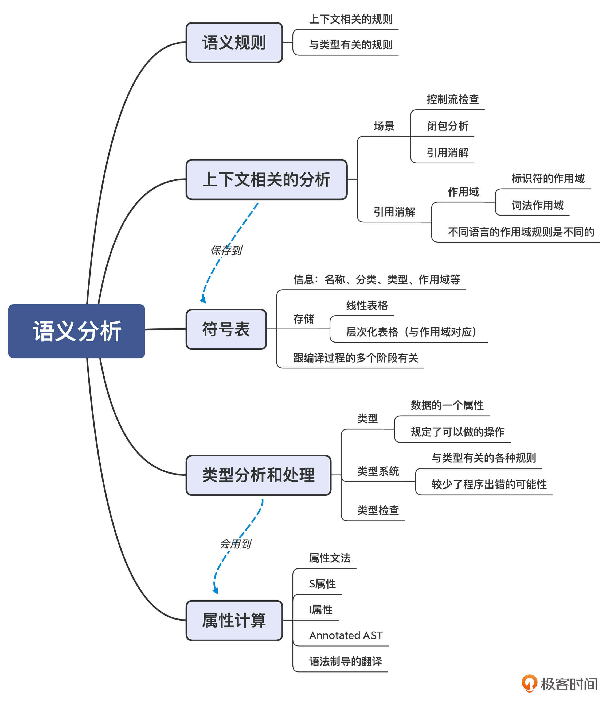

通用资料记录

# Linux

## linux命令与shell

### 文件大小

#### df命令


#### du命令

统计当前文件夹下各个文件夹的大小du -h --max-depth=1

统计所有层级文件du -h，（可用于列出所有文件夹和文件）


### 进程

#### 获得进程ID

```shell
ps |grep kms_master|head -n 1|awk \'(NR=1){print $1}\'
```

#### 获得进程依赖so和内存smaps

cat /prov/进程id/maps

cat /prov/进程id/smaps，包含每个进程的详细内存

smaps内容解释：

VSS - Virtual Set Size 虚拟耗用内存（包含共享库占用的内存）
RSS - Resident Set Size 实际使用物理内存（包含共享库占用的内存）
PSS - Proportional Set Size 实际使用的物理内存（均摊共享库后占用的内存），均摊方式：共享库总内存/进程数量
USS - Unique Set Size 进程独自占用的物理内存（不包含共享库占用的内存）

一般：VSS >= RSS >= PSS >= USS

- **VSS - Virtual Set Size （用处不大）**

  虚拟耗用内存（包含共享库占用的全部内存，以及分配但未使用内存）。其大小还包括了可能不在RAM中的内存（比如虽然malloc分配了空间，但尚未写入）。VSS 很少被用于判断一个进程的真实内存使用量。

  VSS=进程自身占用内存（含虚拟耗用：分配但尚未使用的内存）+ 共享库总内存（进程1的共享部分，进程2共享部分，进程3共享部分；均摊=总÷3)

- **RSS - Resident Set Size （用处不大）**

  实际使用物理内存（包含共享库占用的全部内存）。但是RSS还是可能会造成误导，因为它仅仅表示该进程所使用的所有共享库的大小，它不管有多少个进程使用该共享库，该共享库仅被加载到内存一次。所以RSS并不能准确反映单进程的内存占用情况。

  RSS=进程自身占用内存（不含虚拟耗用）+ 共享库总内存（进程1的共享部分，进程2共享部分，进程3共享部分；均摊=总÷3)

- **PSS - Proportional Set Size （仅供参考）**

  实际使用的物理内存（比例分配共享库占用的内存，按照进程数等比例划分）。

  例如：如果有三个进程都使用了一个共享库，共占用了30页内存。那么PSS将认为每个进程分别占用该共享库10页的大小。

  PSS是非常有用的数据，因为系统中所有进程的PSS都相加的话，就刚好反映了系统中的 总共占用的内存。而当一个进程被销毁之后， 其占用的共享库那部分比例的PSS，将会再次按比例分配给余下使用该库的进程。这样PSS可能会造成一点的误导，因为当一个进程被销毁后， PSS不能准确地表示返回给全局系统的内存。

  PSS=进程自身占用内存（不含虚拟耗用）+ 共享库总内存（均摊；均摊=总÷3)

- **USS - Unique Set Size （非常有用）**

  进程独自占用的物理内存（不包含共享库占用的内存）。USS是非常非常有用的数据，因为它反映了运行一个特定进程真实的边际成本（增量成本）。当一个进程被销毁后，USS是真实返回给系统的内存。当进程中存在一个可疑的内存泄露时，USS是最佳观察数据。

  USS=进程自身占用内存（不含虚拟耗用）

### sed(stream editor)文本操作

#### 删除指定行

```shell
sed -i 'Nd' filename 【N 为行数】

特别的，删除最后一行为：
sed -i '$d' filename 【$ 代表的是最后一行】

【提示】：
cat -n filename //可以从1开始输出显示行号
grep -n "指定行内容" filename //显示指定行行号
```

#### 插入到某行

```shell
①知道该行行号
sed -i 'Ni 要添加内容' filename //第N行插入要添加的内容，原来该行的内容后移

②知道该行内容：
插入到某行上面
sed -i '/定位字符串/i 插入字符串' filename

插入到某行下面
sed -i '/定位字符串/a 插入字符串' filename

补充echo，文末增加一行可使用如下语句：
echo "\n插入字符串" >> filename
```

#### 替换某字符串

```shell
①知道该行行号
sed -i 'Nc 替换内容' filename //替换第N行内容

②知道该行内容
sed -i 's/原字符串/替换字符串/' filename
sed -i 's/原字符串/替换字符串/g' filename 

说明：
s///: 从每一行的行首开始，匹配到第一个符合的字段，就会跳到下一行（同一行中可能有多个匹配字段）
s///g：表示全局替换，匹配每一行从行首到行尾的所有字符
```

#### 替换字符串中部分内容，其实是上边内容的升华用法

```sh
sed -i 's/^\(字符串段1\).*\(字符串段2\)$/\1放入替换段1与段2之间的内容\2/' filename

解读：
^是正则表达式匹配字符串开始位置
$是正则表达式匹配字符串结束位置
\1引用了第一个()匹配到的内容
\2引用了第二个()匹配到的内容
.*为两对括号中间的所有内容
```


#### 指定行添加删除注释

```shell
添加注释
加【#】：
sed -i 's/^指定行字符串/#&/g' filename
加【//】：
sed -i 's/^指定行字符串/\/\/&/g' filename （//由于有特殊含义，前面加\去掉特殊含义）

举例：
 > on property:sys.boot_completed=1
 >     start gps_upgrade
 > root:/vendor/etc/init/hw # sed -i 's/^.*start gps.*/#&/' init.tmp.rc (字符串不一定要写完整行，能唯一标识这一行即可。符合条件的字符串会全部都被添加上注释)
 > root:/vendor/etc/init/hw # 
 > root:/vendor/etc/init/hw # cat init.tmp.rc
 > on property:sys.boot_completed=1
 > #    start gps_upgrade 

删除注释
sed -i 's/^#\(指定行字符串\)/\1/g' filename
```

#### 	其他

```shell
# 对每行匹配到的第一个字符串进行替换
sed -i 's/原字符串/新字符串/' ab.txt 
 
# 对全局匹配上的所有字符串进行替换
sed -i 's/原字符串/新字符串/g' ab.txt 
 
# 删除所有匹配到字符串的行
sed -i '/匹配字符串/d'  ab.txt  
 
# 特定字符串的行后插入新行
sed -i '/特定字符串/a 新行字符串' ab.txt 
 
# 特定字符串的行前插入新行
sed -i '/特定字符串/i 新行字符串' ab.txt
 
# 把匹配行中的某个字符串替换为目标字符串
sed -i '/匹配字符串/s/源字符串/目标字符串/g' ab.txt
 
# 在文件ab.txt中的末行之后，添加bye
sed -i '$a bye' ab.txt   
 
# 对于文件第3行，把匹配上的所有字符串进行替换
sed -i '3s/原字符串/新字符串/g' ab.txt

```


javascript:document.body.contentEditable='true';document.designMode='on';

### 输出重定向符

| 命令        | 说明                                               |
| :---------- | :------------------------------------------------- |
| cmd > file  | 将输出重定向到 file。                              |
| cmd < file  | 将输入重定向到 file。                              |
| cmd >> file | 将输出以追加的方式重定向到 file。                  |
| n > file    | 将文件描述符为 n 的文件重定向到 file。             |
| n >> file   | 将文件描述符为 n 的文件以追加的方式重定向到 file。 |
| n >& m      | 将输出文件 m 和 n 合并。                           |
| n <& m      | 将输入文件 m 和 n 合并。                           |
| << tag      | 将开始标记 tag 和结束标记 tag 之间的内容作为输入。 |

> 注：

- 文件描述符 0 通常是标准输入（STDIN），1 是标准输出（STDOUT），2 是标准错误输出（STDERR）


**输出**

以下两组是等价的

```shell
echo "hello" > t.txt  等价于  echo "hello" 1> t.txt # stdout输出重定向
cmd >> t.txt 等价于 cmd 2>> t.txt # stderr输出追加输出到t.txt
```

如果希望将 stdout 和 stderr 合并后重定向到 file，可以这样写，（用到了**n >& m** 将输出文件 m 和 n 合并）

```shell
cmd > file 2>&1
或 cmd >> file 2>&1
```

如果希望对 stdin 和 stdout 都重定向，可以这样写：(command 命令将 stdin 重定向到 file1，将 stdout 重定向到 file2。)

```shell
cmd < file1 >file2 &
```

- 注：最后一个&表示把条命令放到后台执行

每次都写">log 2>&1"太麻烦，有以下两种简写方式

```shell
cmd >&log
cmd &>log
```

特殊：**>&**符号的理解

```shell
cmd > file 2>&1
```

符号>&是一个整体，重定向的过程，可理解为指针指向。

```shell
#默认1指向屏幕
#因cmd > file改变指向，表示1指向file （1-->file）
#然后2>&1，使得2重定向到1，表示2指向1 （2-->1，又1-->file，则2-->file）
```


**输入**

“<<”：Here Document 是 Shell 中的一种特殊的重定向方式，用来将输入重定向到一个交互式 Shell 脚本或程序。

格式如下：

```shell
cmd << test
    test_contents
test
```

> 注：

- **作用**：将两个test之间的内容（test_contents)作为输入传入给cmd命令。
- 结尾的test必须顶格写，不能有缩进或其他任何字符，其后也不能跟随任何字符。
- 开始的test前后可有空格，自动忽略。

来看个例子：

使用wc -l计算here document的行数

```shell
wc -l << EOF
    line1
    line2
    line3
    line4
EOF
#输出结果
4
```

也可用在脚本中，以下是 test.sh

```shell
#!/bin/bash
wc -l << EOF
    line1
    line2
    line3
    line4
EOF
```

运行后输出

```shell
line1
line2
line3
line4
```


**/dev/null**

使用重定向到/dev/null文件，让某个命令执行后输出的结果不打印在屏幕上。

```shell
cmd > /dev/null
```

/dev/null：一特殊文件，写入的内容会被丢弃，若读/dev/null则读入为空。常用于达到"禁止输出"的效果。

若希望屏蔽stdout和stderr，可写成：

```shell
cmd > /dev/null 2>&1
```

> 注：

- 0是stdin的文件fd，1是stdout，2是stderr。
- 2和>间不能有空格，2>一起才表示错误输出。

### shell里定义整形变量、获得文件夹下所有文件

```shell
# 定义一个不断累加的j，对文件夹下所有文件创建软链接
j=1
for i in ../ln_test_src/* ; do
   ln -s ${i} create_ln/${j}
   j=$((j+1))
   done
```

### shell函数、参数、输入参数

```shell
if [ $# -le "0" ] #输入文件<=0个
    then
        echo "please input one test file! Like \"$0 filename.c\""
        exit 1
fi

if [ $# -ge "2" ] #输入文件>=2个
    then
        echo "unsupport input multi-file yet. please input one test file! Like \"$0 filename.c\""
        exit 1
fi
echo "runing $(basename $0) to test $1"
TestCaseName=$1
ClangOutputFileName="$(basename $TestCaseName).ll"
# ClangRuner="/code/seahorn/build/run/clang+llvm-5.0.0-linux-x86_64-ubuntu16.04/bin/clang-5.0"
ClangRuner="/code/usellvm10/SVF/llvm-10.0.0.obj/bin/clang-10"
# RunClang="$ClangRuner -c -emit-llvm -S $TestCaseName -o $ClangOutputFileName"
RunClang="$ClangRuner -S -c -Xclang -disable-O0-optnone -fno-discard-value-names -emit-llvm $TestCaseName -o $ClangOutputFileName"
echo "$RunClang"
$RunClang

Mem2regCmd="/code/usellvm10/SVF/llvm-10.0.0.obj/bin/opt -S -mem2reg $ClangOutputFileName -o $ClangOutputFileName"
echo "$Mem2regCmd"
$Mem2regCmd

# RmDotFile="rm *.dot"
# $RmDotFile

# SeaDsaBin="/code/sea-dsa/build/run/bin/seadsa"
SeaDsaBin="/code/usellvm10/sea-dsa/build/run/bin/seadsa"
# RunSeaDsaCmd="$SeaDsaBin -sea-dsa=cs -sea-dsa-type-aware -sea-dsa-stats -sea-dsa-dot $ClangOutputFileName"
RunSeaDsaCmd="$SeaDsaBin -sea-dsa=cs -sea-dsa-type-aware -sea-dsa-dot $ClangOutputFileName"
echo "$RunSeaDsaCmd"
$RunSeaDsaCmd

for file in $(ls ./ | grep ".dot$")
do
    GenPdfCmd="dot -Tpdf $file -o $(basename $TestCaseName)_$file.pdf"
    echo "$GenPdfCmd"
    $GenPdfCmd
done
```

## 计算文件MD5

Windows环境 ： certutil -hashfile 【filename】 MD5，windows自带的命令
Linux环境 ： md5sum 【filename】，

```shell
-b, --binary          二进制模式读取
-c, --check           从文件中读取MD5 的校验值并予以检查
    --tag            create a BSD-style checksum
-t, --text            纯文本模式读取(默认)
Note: There is no difference between binary and text mode option on GNU system.
```

Mac环境 : md5 【filename】, 如果想要输出Linux下同样的格式，可使用：md5 -r 【filename】。计算某个字符串的md5值：Downloads md5 -s "Hello World"

## 函数调用tracer工具

https://www.cnblogs.com/slgkaifa/p/6919967.html

## linux粘滞位

 前面说了修改了目录文件的写权限，就可以删除目录下的文件，那么这里就有个问题，就是我自己写的文件，给别的用户开了权限后，别的用户就可以删除这个文件了，但是这是不好的，所以这里Linux引入了粘滞位的概念。
chmod +t 目录文件名   //添加粘滞位
chmod -t 目录文件名    //移除粘滞位
设置完粘滞位后会出现一个 t ，这样就可以让别的用户删除不了文件夹及其里面的文件了，但是自己可以删除自己的文件。

PS： 粘滞位只能给目录设置。 谁设置谁取消（root）。

#

# OS与体系结构


# 

# 编译器领域

# 词法分析


# 语法分析
两个基本功：第一，必须能够阅读和书写语法规则，也就是掌握上下文无关文法；第二，必须要掌握递归下降算法。
两种算法思路：一种是自顶向下的语法分析，另一种则是自底向上的语法分析。

## 上下文无关文法（Context-Free Grammar）

语法规则应该怎么写：

```angelscript
 int a = 2;
 int b = a + 3;
 return b;
```

第一种写法是下面这个样子，它看起来跟上一讲的词法规则差不多，都是左边是规则名称，右边是正则表达式。

```awk
start：blockStmts ;               //起始
block : '{' blockStmts '}' ;      //语句块
blockStmts : stmt* ;              //语句块中的语句
stmt = varDecl | expStmt | returnStmt | block;   //语句
varDecl : type Id varInitializer？ ';' ;         //变量声明
type : Int | Long ;                              //类型
varInitializer : '=' exp ;                       //变量初始化
expStmt : exp ';' ;                              //表达式语句
returnStmt : Return exp ';' ;                    //return语句
exp : add ;                                      //表达式       
add : add '+' mul | mul;                         //加法表达式
mul : mul '*' pri | pri;                         //乘法表达式
pri : IntLiteral | Id | '(' exp ')' ;            //基础表达式 
```

在语法规则里，我们把冒号左边的叫做**非终结符**（Non-terminal），又叫**变元**（Variable）。非终结符可以按照右边的正则表达式来逐步展开，直到最后都变成标识符、字面量、运算符这些不可再展开的符号，也就是**终结符**（Terminal）。终结符其实也是词法分析过程中形成的Token。
> 注：
> 非终结符以小写字母开头，终结符则以大写字母开头，或者是一个原始的字符串格式
> Token和终结符这两个术语互换使用。像这样左边是非终结符，右边是正则表达式的书写语法规则的方式，就叫做扩展巴科斯范式（EBNF）。在ANTLR这样的语法分析器生成工具中，经常会看到这种格式的语法规则。对于EBNF的严格定义，可以去参考Wikipedia上的解释。在教科书中是产生式（Production Rule），又叫做替换规则（Substitution Rule）。产生式的左边是非终结符（变元），它可以用右边的部分替代，中间通常会用箭头连接。
> 为了避免跟EBNF中的“*”号、“+”号等冲突，凡是采用EBNF格式，就给字符串格式的终结符加引号，左右两边用“::=”或冒号分隔开；凡是采用产生式，字符串就不加引号，并且采用“->”分隔产生式的左右两侧。

语法规则是由4个部分组成的：

一个有穷的非终结符（或变元）的集合；
一个有穷的终结符的集合；
一个有穷的产生式集合；
一个起始非终结符（变元）。
那么符合这四个特点的文法规则，就叫做上下文无关文法（Context-Free Grammar，CFG）。正则文法是上下文无关文法的一个子集。其实，正则文法也可以写成产生式的格式。比如，数字字面量（正则表达式为“[0-9]+”）可以写成：

```xl
IntLiteral -> Digit IntLiteral1
IntLiteral1 -> Digit IntLiteral1 
IntLiteral1 -> ε
Digit -> [0-9]
```

但是，在上下文无关文法里，产生式的右边可以放置任意的终结符和非终结符，而正则文法只是其中的一个子集，叫做**线性文法**（Linear Grammar）。它的特点是产生式的右边部分最多只有一个非终结符，比如X->aYb，其中a和b是终结符。
## 递归下降算法（Recursive Descent Parsing）

递归下降算法其实很简单，它的基本思路就是按照语法规则去匹配Token串。比如说，变量声明语句的规则如下：

```awk
varDecl : types Id varInitializer？ ';' ;        //变量声明
varInitializer : '=' exp ;                       //变量初始化
exp : add ;                                      //表达式       
add : add '+' mul | mul;                         //加法表达式
mul : mul '*' pri | pri;                         //乘法表达式
pri : IntLiteral | Id | '(' exp ')' ;            //基础表达式
```

如果写成产生式格式，是下面这样：

```xl
varDecl -> types Id varInitializer ';' 
varInitializer -> '=' exp              
varInitializer -> ε
exp -> add
add -> add + mul
add -> mul
mul -> mul * pri
mul -> pri
pri -> IntLiteral
pri -> Id
pri -> ( exp )
```

而基于这个规则做解析的算法如下：

```xl
匹配一个数据类型(types)
匹配一个标识符(Id)，作为变量名称
匹配初始化部分(varInitializer)，而这会导致下降一层，使用一个新的语法规则：
   匹配一个等号
   匹配一个表达式(在这个步骤会导致多层下降：exp->add->mul->pri->IntLiteral)
   创建一个varInitializer对应的AST节点并返回
如果没有成功地匹配初始化部分，则回溯，匹配ε，也就是没有初始化部分。
匹配一个分号   
创建一个varDecl对应的AST节点并返回
```

用上述算法解析“int a = 2”，就会生成下面的AST：

递归下降算法的特点是：

- 对于一个非终结符，要从左到右依次匹配其产生式中的每个项，包括非终结符和终结符。
- 在匹配产生式右边的非终结符时，要下降一层，继续匹配该非终结符的产生式。
- 如果一个语法规则有多个可选的产生式，那么只要有一个产生式匹配成功就行。如果一个产生式匹配不成功，那就回退回来，尝试另一个产生式。这种回退过程，叫做回溯（Backtracking）。

有两个缺点：
- 左递归（Left Recursion）问题
- 当产生式匹配失败的时候，必须要“回溯”，这就可能导致浪费。

**左递归（Left Recursion）问题解释**

比如，在匹配算术表达式时，产生式的第一项就是一个非终结符add，那么按照算法，要下降一层，继续匹配add。这个过程会一直持续下去，无限递归下去。

```routeros
add -> add + mul
```

所以，递归下降算法是无法处理左递归问题的。那么有什么解决办法吗？

你可能会说，把产生式改成右递归不就可以了吗？也就是add这个递归项在右边：

```routeros
add -> mul + add
```

这样确实可以避免左递归问题，但它同时也会导致**结合性**的问题。

举个例子来说，我们按照上面的语法规则来解析“2+3+4”这个表达式，会形成如下所示的AST。

图3：结合性错误的AST

它会先计算“3+4”，而不是先计算“2+3”。这破坏了加法的结合性规则，加法运算本来应该是左结合的。

其实有一个标准的方法，能避免左递归问题。我们可以改写原来的语法规则，也就是引入`add'`，把左递归变成右递归：

```llvm
add -> mul add'
add' -> + mul add' | ε
```

接下来，我们用刚刚改写的规则再次解析一下 “2+3+4”这个表达式，会得到下图中的AST：

你能看出，这种改写方法虽然能够避免左递归问题，但由于`add'`的规则是右递归的，采用标准的递归下降算法，仍然会出现运算符结合性的错误。那么针对这点，我们有没有解决办法呢？

有的，方法就是**把递归调用转化成循环**。这里利用了很多同学都知道的一个原理，即递归调用可以转化为循环。

其实我把上面的规则换成用EBNF方式来表达就很清楚了。在EBNF格式里，允许用“*”号和“+”号表示重复：

```avrasm
add ： mul ('+' mul)*  ；
```

所以说，对于`('+'mul)*`这部分，我们其实可以写成一个循环。而在循环里，我们可以根据结合性的要求，手工生成正确的AST。它的伪代码如下：

```avrasm
左子节点 = 匹配一个mul
while(下一个Token是+){
  消化掉+
  右子节点 = 匹配一个mul
  用左、右子节点创建一个add节点
  左子节点 = 该add节点
}
```

采用上面的算法，就可以创建正确的AST，如下图所示：


## LL算法：计算First和Follow集合

LL算法的要点，就是计算First和Follow集合。

**First集合是每个产生式开头可能会出现的Token的集合。**
针对非终结符x，它的First集合的计算规则是这样的：

如果产生式以终结符开头，那么把这个终结符加入First(x)；
如果产生式以非终结符y开头，那么把First(y)加入First(x);
如果First(y)包含ε，那要把下一个项的First集合也加入进来，以此类推；
如果x有多个产生式，那么First(x)是每个产生式的并集。
在计算First集合的时候，具体可以采用“不动点法”。相关细节这里就不展开了，你可以参考示例程序FirstFollowSet类的CalcFirstSets()方法，运行示例程序能打印各个非终结符的First集合。
**对于某个非终结符后面可能跟着的Token的集合，我们叫做Follow集合。**如果预读到的Token在Follow中，那么我们就可以判断当前正在匹配的这个非终结符，产生了ε。

Follow的算法也比较简单，以非终结符x为例：

- 扫描语法规则，看看x后面都可能跟着哪些符号；
- 对于后面跟着的终结符，都加到Follow(x)集合中去；
- 如果后面是非终结符y，就把First(y)加Follow(x)集合中去；
- 最后，如果First(y)中包含ε，就继续往后找；
- 如果x可能出现在程序结尾，那么要把程序的终结符$加入到Follow(x)中去。

这样在计算了First和Follow集合之后，你就可以通过预读一个Token，来完全确定采用哪个产生式。这种算法，就叫做**LL(1)算法**。

LL(1)中的第一个L，是Left-to-right的缩写，代表从左向右处理Token串。第二个L，是Leftmost的缩写，意思是最左推导。**最左推导是什么呢？**就是它总是先把产生式中最左侧的非终结符展开完毕以后，再去展开下一个。这也就相当于对AST从左子节点开始的深度优先遍历。LL(1)中的1，指的是预读一个Token。
## LR算法：移进和规约

前面讲的递归下降和LL算法，都是自顶向下的算法。还有一类算法，是自底向上的，其中的代表就是**LR算法**。

自顶向下的算法，是从根节点逐层往下分解，形成最后的AST；而LR算法的原理呢，则是从底下先拼凑出AST的一些局部拼图，并逐步组装成一棵完整的AST。**所以，其中的关键之处在于如何“拼凑”。**

假设我们采用下面的上下文无关文法，来推演一个实例，具体语法规则如下所示：

```xl
start->add
add->add+mul
add->mul
mul->mul*pri
mul->pri
pri->Int
pri->(add)
```

如果用于解析“2+3*5”，最终会形成下面的AST：

LR算法和LL算法一样，也是从左到右地消化掉Token。在第1步，它会取出“2”这个Token，放到一个栈里，这个栈是用来组装AST的工作区。同时，它还会预读下一个Token，也就是“+”号，用来帮助算法做判断。

在下面的示意图里，我画了一条橙色竖线，竖线的左边是栈，右边是预读到的一个Token。在做语法解析的过程中，竖线会不断地往右移动，把Token放到栈里，这个过程叫做“移进”（Shift）。

图7：第1步，移进一个Token
注意，我在图7中还用虚线框推测了AST的其他部分。也就是说，如果第一个Token遇到的是整型字面量，而后面跟着一个+号，那么这两个Token就决定了它们必然是这棵推测出来的AST的一部分。而图中右边就是它的推导过程，其中的每个步骤，都使用了一个产生式加了一个点（如“.add”)。这个点，就相当于图中左边的橙色竖线。

所以你就可以根据这棵假想的AST，也就是依据假想的推导过程，给它反推回去。把Int还原为pri。这个还原过程，就叫做“规约”（Reduce）。工作区里的元素也随之更新成pri。

图8：第2步，Int规约为pri
按照这样的思路，不断地移进和规约，这棵AST中推测出来的节点会不断地被证实。而随着读入的Token越来越多，这棵AST也会长得越来越高，整棵树变得更大。下图是推导过程中间的一个步骤。
这个推导过程写成严密的算法，你可以参考《编译原理之美》的第18讲。


# 语义分析
语义规则可以分为两大类。

第一类规则与上下文有关。因为我们说了，语法分析只能处理与上下文无关的工作。而与上下文有关的工作呢，自然就放到了语义分析阶段。

第二类规则与类型有关。在计算机语言中，类型是语义的重要载体。所以，语义分析阶段要处理与类型有关的工作。比如，声明新类型、类型检查、类型推断等。在做类型分析的时候，我们会用到一个工具，就是属性计算，也是需要你了解和掌握的。

补充：某些与类型有关的处理工作，还必须到运行期才能去做。比如，在多态的情况，调用一个方法时，到底要采用哪个子类的实现，只有在运行时才会知道。这叫做动态绑定。

在语义分析过程中，会使用两个数据结构。一个还是AST，但我们会把语义分析时获得的一些信息标注在AST上，形成带有标注的AST。另一个是符号表，用来记录程序中声明的各种标识符，并用于后续各个编译阶段。
## 上下文相关的分析

在解析一个程序时，会有非常多的分析工作要结合上下文来进行。三个场景：

**场景1：控制流检查**

像return、break和continue等语句，都与程序的控制流有关，它们必须符合控制流方面的规则。在Java这样的语言中，语义规则会规定：如果返回值不是void，那么在退出函数体之前，一定要执行一个return语句，那么就要检查所有的控制流分支，是否都以return语句结尾。

**场景2：闭包分析**

很多语言都支持闭包。而要正确地使用闭包，就必须在编译期知道哪些变量是自由变量。这里的自由变量是指在本函数外面定义的变量，但被这个函数中的代码所使用。这样，在运行期，编译器就会用特殊的内存管理机制来管理这些变量。所以，对闭包的分析，也是上下文敏感的。

**场景3：引用消解**

引用消解（Reference Resolution），有时也被称作名称消解（Name Resolution）或者标签消解（Label Resolution）。对变量名称、常量名称、函数名称、类型名称、包名称等的消解，都属于引用消解。因此，引用消解是一种非常重要的上下文相关的语义规则。

在高级语言里，我们会做变量、函数（或方法）和类型的声明，然后在其他地方使用它们。这个时候，我们要找到定义和使用之间的正确引用关系。

在语法分析阶段，对于“int b = a + 3”这样一条语句，无论a是否提前声明过，在语法上都是正确的。而在实际的计算机语言中，如果引用某个变量，这个变量就必须是已经声明过的。同时，当前这行代码，要处于变量a的作用域中才行。

对于变量来说，为了找到正确的引用，就需要用到作用域（Scope)这个概念。在编译技术里面，作用域这个词，有两个稍微有所差异的使用场景。

作用域的第一个使用场景，指的是变量、函数等标识符可以起作用的范围。下图列出了三个变量的作用域，每个变量声明完毕以后，它的下一句就可以引用它。

作用域的第二个使用场景，是词法作用域（Lexical Scope），也就是程序中的不同文本区域。比如，一个语句块、参数列表、类定义的主体、函数（方法）的主体、模块主体、整个程序等。
标识符和词法的作用域的差异在于：一个本地变量（标识符）的作用域，虽然属于某个词法作用域（如某个函数体），但其作用范围只是在变量声明之后的语句。而类的成员变量（标识符)的作用域，跟词法作用域是一致的，也就是整个类的范围，跟声明的位置无关。如果这个成员变量不是私有的，它的作用域还会覆盖到子类。

## 符号表（Symbol Table）

在写程序的时候，我们会定义很多标识符，比如常量名称、变量名称、函数名称、类名称，等等。在编译器里，我们又把这些标识符叫做符号（Symbol）。用来保存这些符号的数据结构，就叫做符号表。

比如，对于变量a来说，符号表中的基本信息可以包括：

- 名称：a
- 分类：变量
- 类型：int
- 作用域：foo函数体
- 其他必要的信息。
符号表的具体实现，每个编译器可能都不同。比如，它可能是一张线性的表格，也可能是按照作用域形成的一种有层次的表格。以下面这个程序为例，它包含了两个函数，每个函数里面都定义了多个变量：

```csharp
void foo(){
  int a；
  int b；
  if (a>0){
    int c;
    int d;
  }
  else{
    int e;
    int f;
  }
}

void bar(){
  int g;
  {
    int h;
    int i;
  }
}
```

它的符号表可能是下面这样的，分成了多个层次，每个层次对应了一个作用域。在全局作用域，符号表里包含foo和bar两个函数。在foo函数体里，有两个变量a和b，还有两个内部块，每个块里各有两个变量。

图3：一种层次化的符号表
那针对引用消解，其实就是从符号表里查找被引用的符号的定义，如下图所示：

图4：利用符号表帮助做引用消解
更进一步地，符号表除了用于引用消解外，还可以辅助完成语义分析的其他工作。比如，在做类型检查的时候，我们可以从符号表里查找某个符号的类型，从而检查类型是否兼容。

其实，不仅仅是在语义分析阶段会用到符号表，其他的编译阶段也会用到。比如，早在词法分析阶段，你就可以为符号表建立条目；在生成IR、做优化和生成目标代码的时候，都会用到符号表里的信息。


## 类型分析和处理

语义分析阶段的一个重要工作就是做类型检查，现代语言还普遍增加了类型推断的能力。

通常来说，**在计算机语言里，类型是数据的一个属性，它的作用是来告诉编译器或解释器，程序可以如何使用这些数据。**比如说，对于整型数据，它可能占32或者64位存储，我们可以对它做加减乘除操作。而对于字符串，它可能占很多个字节，并且通过一定的编码规则来表示字符。字符串可以做连接、查找、获取子字符串等操作，但不能像整数一样做算术运算。

一门语言的**类型系统**是包含了与类型有关的各种规则的一个逻辑系统。类型系统包含了一系列规则，规定了如何把类型用于变量、表达式和函数等程序元素，以及如何创建自定义类型，等等。比如，如果你定义了某个类有哪些方法，那你就只能通过调用这些方法来使用这个类，没有别的方法。这些强制规定减少了程序出错的可能性。

所以在语义分析阶段，一个重要的工作就是做类型检查。编译器一般会采用**属性计算**的方法，来计算出每个AST节点的类型属性，然后检查它们是否匹配。

## 属性计算

以“int b = a+3”为例，它的AST如下图所示。编译器会计算出b节点所需的类型和init节点的实际类型，比较它们是否一致（或者可以自动转换）。

首先要计算等号右边“a+3”的类型。其中，3是个整型字面量，我们可以据此把它的类型标注为整型；a是一个变量，它的类型可以从符号表中查到，也是整型。根据加法的语义，两个整型数据相加，结果仍然是整型，因此“a+3”这个表达式整体是整型的。因为init只有一个子节点（add），所以init的类型也一样是整型。根据变量声明的语义，b的类型就是int，因此它的类型是从AST的兄弟节点中获得的。这过程就是属性计算。其中，有些属性是通过子节点计算出来的，这叫做 S属性（Synthesized Attribute，综合出来的属性），比如等号右边的类型。而另一些属性，则要根据父节点或者兄弟节点计算而来，这种属性叫做 I属性（Inherited Attribute，继承到的属性)，比如等号左边的b变量的类型。

计算出来的属性，我们可以标注在AST上，这就形成我第1讲曾经提过的带有标注信息的AST，（Annotated Tree），也有人称之为Decorated Tree，或者Attributed Tree。虽然叫法有很多，但都是一个意思，都是向AST中添加了语义信息。

属性计算的方法，就是基于语法规则，来定义一些属性计算的规则，在遍历AST的时候执行这些规则，我们就可以计算出属性值。这种基于语法规则定义的计算规则，被叫做**属性文法（Attribute Grammar）**。
补充：基于属性计算的方法可以做类型检查，那其实也可以做类型推断。有些现代语言在声明一个变量的时候，可以不明确指定的类型，那么它的类型就可以通过变量声明语句的右边部分推断出来。
根据不同语言的语义，可能有不同的属性需要计算。其实，value（值)也可以看做是一个属性，你可以给每个节点定义一个“value”属性。对表达式求值，也就是对value做属性计算，比如，“a + 3”的值，我们就可以自下而上地计算出来。这样看起来，value是一个S属性。

针对value这个属性的属性文法，你可以参考下面这个例子，在做语法解析（或先解析成AST，再遍历AST）的时候，执行方括号中的规则，我们就可以计算出AST的值了。

```mipsasm
add1 → add2 + mul [ add1.value = add2.value + mul.value ]
add → mul [ add.value = mul.value ]
mul1 → mul2 * primary [ mul1.value = mul2.value * primary.value ]
mul → primary [ mul.value = primary.value ]
primary → ( add ) [ primary.value =  add.value ]
primary → integer [ primary.value = strToInt(integer.str) ]
```

这种在语法规则上附加一系列动作，在解析语法的时候执行这些动作的方式，是一种编译方法，在龙书里有一个专门的名字，叫做**语法制导的翻译**（Syntax Directed Translation，SDT）。使用语法制导的翻译可以做很多事情，包括做属性计算、填充符号表，以及生成IR。



# IR
IR，也就是中间代码（Intermediate Representation，有时也称Intermediate Code，IC），它是编译器中很重要的一种数据结构。编译器在做完前端工作以后，首先就是生成IR，并在此基础上执行各种优化算法，最后再生成目标代码。
## IR的用途和层次

通常IR有两种用途，一是做分析和变换，二是直接解释执行的。先看第一种。

编译器中，基于IR的分析和处理工作，一开始可以基于一些抽象层次比较高的语义，这时所需要的IR更接近源代码。而在后面，则会使用低层次的、更加接近目标代码的语义。

基于这种从高到低的抽象层次，IR可以归结为HIR、MIR和LIR三类。

### HIR：基于源语言做一些分析和变换

一款IDE，最主要的功能包括：发现语法错误、分析符号之间的依赖关系（以便进行跳转、判断方法的重载等）、根据需要自动生成或修改一些代码（提供重构能力）。

这时对IR的需求，是能够准确表达源语言的语义就行了。这种可叫做High IR，简称HIR。

其实，AST和符号表就可以满足这个需求。也就是说，AST也可以算作一种IR。如果要开发IDE、代码翻译工具（从一门语言翻译到另一门语言）、代码生成工具、代码统计工具等，使用AST（加上符号表）就够了。

当然，有些HIR并不是树状结构（比如可以采用线性结构），但一般会保留诸如条件判断、循环、数组等抽象层次比较高的语法结构。

基于HIR，可以做一些高层次的代码优化，比如常数折叠、内联等。在Java和Go的编译器中，你可以看到不少基于AST做的优化工作。

### MIR：独立于源语言和CPU架构做分析和优化

大量的优化算法是可以通用的，没有必要依赖源语言的语法和语义，也没有必要依赖具体的CPU架构。

这些优化包括部分算术优化、常量和变量传播、死代码删除等。实现这类分析和优化功能的IR可以叫做Middle IR，简称MIR。

因为MIR跟源代码和目标代码都无关，所以在讲解优化算法时，通常是基于MIR，比如**三地址代码（Three Address Code，TAC）**。

TAC的特点是，最多有三个地址（也就是变量），其中赋值符号的左边是用来写入的，而右边最多可以有两个地址和一个操作符，用于读取数据并计算。

我们来看一个例子，示例函数foo：

```abnf
int foo (int a){
  int b = 0;
  if (a > 10)
    b = a;
  else
    b = 10;
  return b;
}
```

对应的TAC可能是：

```go
BB1:
  b := 0
  if a>10 goto BB3   //如果t是false(0),转到BB3
BB2:
  b := 10
  goto BB4
BB3:
  b := a
BB4:
  return b
```

可以看到，TAC用goto语句取代了if语句、循环语句这种比较高级的语句，当然也不会有类、继承这些高层的语言结构。但是，它又没有涉及数据如何在内存读写等细节，书写格式也不像汇编代码，与具体的目标代码也是独立的。

所以，它的抽象程度算是不高不低。

### LIR：依赖于CPU架构做优化和代码生成

最后一类IR就是Low IR，简称LIR。

这类IR的特点，是它的指令通常可以与机器指令一一对应，比较容易翻译成机器指令（或汇编代码）。因为LIR体现了CPU架构的底层特征，因此可以做一些与具体CPU架构相关的优化。

比如，下面是Java的JIT编译器输出的LIR信息，里面的指令名称已经跟汇编代码很像了，并且会直接使用AMD64架构的寄存器名称。

图1：Java的JIT编译器的LI
HIR、MIR和LIR这种划分方法，主要是参考“鲸书（Advanced Compiler Design and Implementation)”的提法。

## P-code：用于解释执行的IR

前3类IR是从抽象层次来划分的，都是用来做分析和变换的。

第二种直接用于解释执行的IR。这类IR还有一个名称，叫做P-code，也就是Portable Code的意思。由于它与具体机器无关，因此可以很容易地运行在多种电脑上。这类IR对编译器来说，就是做编译的目标代码。

Java的字节码就是这种IR。Python、Erlang也有自己的字节码，.NET平台、Visual Basic程序也不例外。

其实，也完全可以基于AST实现一个全功能的解释器，只不过性能会差一些。对于专门用来解释执行IR，通常会有一些特别的设计，跟虚拟机配合来尽量提升运行速度。

需注意的是，P-code也可能被进一步编译，形成可以直接执行的机器码。Java的字节码就是这样的例子。之后探究Java的两个编译器，一个把源代码编译成字节码，一个把字节码编译成目标代码（支持JIT和AOT两种方式）。

## IR的呈现格式

其实IR通常是没有书写格式的。一方面，大多数的IR跟AST一样，只是编译过程中的一个数据结构而已，或者说只有内存格式。比如，LLVM的IR在内存里是一些对象和接口。

另一方面，为了调试的需要，你可以把IR以文本的方式输出，用于显示和分析。在这门课里，你也会看到很多IR的输出格式。比如，下面是Julia的IR：

图2：Julia语言输出的IR信息

在少量情况下，IR有比较严格的输出格式，不仅用于显示和分析，还可以作为结果保存，并可以重新读入编译器中。比如，LLVM的bitcode，可以保存成文本和二进制两种格式，这两种格式间还可以相互转换。

我们以C语言为例，来看下fun1函数，及其对应的LLVM IR的文本格式和二进制格式：

```arduino
//fun1.c 
int fun1(int a, int b){
    int c = 10;
    return a+b+c;
}
```

LLVM IR的文本格式（用“clang -emit-llvm -S fun1.c -o fun1.ll”命令生成，这里只节选了主要部分）：

```llvm
; ModuleID = 'fun1.c'
source_filename = "function-call1.c"
target datalayout = "e-m:o-i64:64-f80:128-n8:16:32:64-S128"
target triple = "x86_64-apple-macosx10.14.0"

; Function Attrs: noinline nounwind optnone ssp uwtable
define i32 @fun1(i32, i32) #0 {
  %3 = alloca i32, align 4
  %4 = alloca i32, align 4
  %5 = alloca i32, align 4
  store i32 %0, i32* %3, align 4
  store i32 %1, i32* %4, align 4
  store i32 10, i32* %5, align 4
  %6 = load i32, i32* %3, align 4
  %7 = load i32, i32* %4, align 4
  %8 = add nsw i32 %6, %7
  %9 = load i32, i32* %5, align 4
  %10 = add nsw i32 %8, %9
  ret i32 %10
}
```

二进制格式（用“clang -emit-llvm -c fun1.c -o fun1.bc”命令生成，用“hexdump -C fun1.bc”命令显示）：

图3：LLVM IR的二进制格式

## IR的数据结构

既然我们一直说IR会表现为内存中的数据结构，在实际的实现中，有线性结构、树结构、有向无环图（DAG）、程序依赖图（PDG）等多种格式。编译器会根据需要，选择合适的数据结构。在运行某些算法的时候，采用某个数据结构可能会更顺畅，而采用另一些结构可能会带来内在的阻滞。所以，**我们一定要根据具体要处理的工作的特点，来选择合适的数据结构。**

### 第一种：类似TAC的线性结构（Linear Form）

你可以把代码表示成一行行的指令或语句，用数组或者列表保存就行了。其中的符号，需要引用符号表，来提供类型等信息。

这种线性结构有时候也被称作goto格式。因为高级语言里的条件语句、循环语句，要变成用goto语句跳转的方式。

### 第二种：树结构

树结构当然可以用作IR，AST就是一种树结构。

很多资料中讲指令选择的时候，也会用到一种树状的结构，便于执行树覆盖算法。这个树结构，就属于一种LIR。

树结构的缺点是，可能有冗余的子树。比如，语句“`a=5; b=(2+a)+a*3;` ”形成的AST就有冗余。如果基于这个树结构生成代码，可能会做两次从内存中读取a的值的操作，并存到两个临时变量中。

图4：冗余的子树

### 第三种：有向无环图（Directed Acyclic Graph，DAG）

DAG结构，是在树结构的基础上，消除了冗余的子树。比如，上面的例子转化成DAG以后，对a的内存访问只做一次就行了。


图5：DAG结构消除了冗余的子树

在LLVM的目标代码生成环节，就使用了DAG来表示基本块内的代码。

### 第四种：程序依赖图（Program Dependence Graph，PDG）

程序依赖图，是显式地把程序中的数据依赖和控制依赖表示出来，形成一个图状的数据结构。基于这个数据结构，我们再做一些优化算法的时候，会更容易实现。

所以现在，有很多编译器在运行优化算法的时候，都基于类似PDG的数据结构，比如我在课程后面会分析的Java的JIT编译器和JavaScript的编译器。

这种数据结构里，因为会有很多图节点，又被形象地称为“**节点之海（Sea of Nodes）**”。

以上就是常用于IR的数据结构了。接下来，我再介绍一个重要的IR设计范式：SSA格式。

## SSA格式的IR

SSA是Static Single Assignment的缩写，也就是静态单赋值。这是IR的一种设计范式，它要求一个变量只能被赋值一次。我们来看个例子。

“y = x1 + x2 + x3 + x4”的普通TAC如下：

```llvm
y := x1 + x2;
y := y + x3;
y := y + x4;
```

其中，y被赋值了三次，如果我们写成SSA的形式，就只能写成下面的样子：

```llvm
t1 := x1 + x2;
t2 := t1 + x3;
y  := t2 + x4; 
```

**那我们为什么要费力写成这种形式呢，还要为此多添加t1和t2两个临时变量？**

原因是，使用SSA的形式，体现了精确的“**使用-定义（use-def）**”关系。并且由于变量的值定义出来以后就不再变化，使得基于SSA更容易运行一些优化算法。在后面的课程中，我会通过实际的例子带你体会这一点。

在SSA格式的IR中，还会涉及一个你经常会碰到的，但有些特别的指令，叫做 **phi指令**。我们看一个例子。

同样对于示例代码foo：

```abnf
int foo (int a){
  int b = 0;
  if (a > 10)
    b = a;
  else
    b = 10;
  return b;
}
```

它对应的SSA格式的IR可以写成：

```mipsasm
BB1:
  b1 := 0
  if a>10 goto BB3
BB2:
  b2 := 10
  goto BB4
BB3:
  b3 := a
BB4:
  b4 := phi(BB2, BB3, b2, b3)
  return b4
```

其中，变量b有4个版本：b1是初始值，b2是else块（BB2）的取值，b3是if块（BB3）的取值，最后一个基本块（BB4）要把b的最后取值作为函数返回值。很明显，b的取值有可能是b2，也有可能是b3。这时候，就需要phi指令了。

phi指令，会根据控制流的实际情况确定b4的值。如果BB4的前序节点是BB2，那么b4的取值是b2；而如果BB4的前序节点是BB3，那么b4的取值就是b3。所以你会看到，如果要满足SSA的要求，也就是一个变量只能赋值一次，那么在遇到有程序分支的情况下，就必须引入phi指令。

最后我要指出的是，**由于SSA格式的优点，现代语言用于优化的IR，很多都是基于SSA的了，包括我们本课程涉及的Java的JIT编译器、JavaScript的V8编译器、Go语言的gc编译器、Julia编译器，以及LLVM工具等。**


## 常见的代码优化方法

对代码做优化的方法有很多。可以按照下面两个维度：

- **第一个维度，是机器无关的优化与机器相关的优化。**机器无关的优化与硬件特征无关，比如把常数值在编译期计算出来（常数折叠）。而机器相关的优化则需要利用某硬件特有的特征，比如SIMD指令可以在一条指令里完成多个数据的计算。
- **第二个维度，是优化的范围。**本地优化是针对一个基本块中的代码，全局优化是针对整个函数（或过程），过程间优化则能够跨越多个函数（或过程）做优化。

但优化算法很多，仅仅按照这两个维度分类，仍显粗糙。以下按照优化的实现思路再分分类：

### 思路1：把常量提前计算出来

程序里的有些表达式，肯定能计算出一个常数值，那就不要等到运行时再去计算，干脆在编译期就计算出来。比如 “`x=2*3`”优化成“`x=6`”。这种叫做**常数折叠（Constant Folding）**。

而如果一旦知道x的值其实是一个常量，那就可把所有用到x的地方，替换成这个常量，这叫**常数传播（Constant Propagation）**。如果有“`y=x*2`”语句，那就能计算出来“`y=12`”。所以，常数传播会导致更多的常数折叠。

就算不能引起新的常数折叠，比如说“`z=a+x`”，替换成“`z=a+6`”以后，计算速度也会更快。因为对于很多CPU来说，“`a+x`”和“`a+6`”对应的指令是不一样的。前者可能要生成两条指令（比如先把a放到寄存器上，再把x加上去），而后者用一条指令就行了，因为常数可以作为操作数。

更有用的是，常数传播可能导致分支判断条件是常量，因此导致一个分支的代码不需要被执行。这种优化叫做**稀疏有条件的常数传播（Sparse Conditional Constant Propagation）**。

```stylus
a = 2
b = 3
if(a<b){  //判断语句去掉
  ...     //直接执行这个代码块
}
else{
  ...     //else分支会去掉
}
```

### 思路2：用低代价的方法做计算

完成相同的计算，可以用代价更低的方法。比如“`x=x+0`”这行代码，操作前后x没有任何变化，所以这样的代码可以删掉；又比如“`x=x*0`” 可以简化成“`x=0`”。这类利用代数运算的规则所做的简化，叫做**代数简化（Algebra Simplification）。**

对于很多CPU来说，乘法运算改成移位运算，速度会更快。比如，“`x*2`”等价于“`x<<1`”，“`x*9`”等价于“`x<<3+x`”。这种采用代价更低的运算的方法，也叫做**强度折减（Strength Reduction）**。

### 思路3：消除重复的计算

下面的示例代码中，第三行可以被替换成“`z:=2*x`”， 因为y的值就等于x。这时候，可能x的值已经在寄存器中，所以直接采用x，运算速度会更快。这种优化叫做**拷贝传播（Copy Propagation）。**

```go
x := a + b
y := x
z := 2 * y
```

**值编号（Value Numbering）**也能减少重复计算。值编号是把相同的值，在系统里给一个相同的编号，并且只计算一次即可。比如，[Wikipedia](https://en.wikipedia.org/wiki/Value_numbering)上的这个案例：

```apache
w := 3
x := 3
y := x + 4
z := w + 4
```

其中w和x的值是一样的，因此编号是相同的。这会进一步导致y和z的编号也是相同的。进而，它们可以简化成：

```go
w := 3
x := w
y := w + 4
z := y
```

值编号又可以分为两种，本地值编号（在一个基本块中）和全局值编号（GVN，在一个函数范围内）。

还有一种优化方法叫做**公共子表达式消除（Common Subexpression Elimination，CSE），**也会减少计算次数。下面这两行代码，x和y右边的形式是一样的，如果这两行代码之间，a和b的值没有发生变化（比如采用SSA形式），那么x和y的值一定是一样的。

```stylus
x := a + b
y := a + b
```

那我们就可以让y等于x，从而减少了一次对“`a+b`”的计算，这就是公共子表达式消除。

```go
x := a + b
y := x
```

**部分冗余消除（Partial Redundancy Elimination，PRE）**，是公共子表达式消除的一种特殊情况。比如，这个来自[Wikipedia](https://en.wikipedia.org/wiki/Partial_redundancy_elimination)的例子中，一个分支有“`x+4`”这个公共子表达式，而另一个分支则没有。

```actionscript
if (some_condition) {
   // some code that does not alter x
   y = x + 4;
 }
 else {
   // other code that does not alter x
 }
 z = x + 4;
```

但是，上述代码仍然可以优化，使得在if结构中，“`x+4`”这个值肯定会被计算一次，因此“`z=x+4`”就可以被优化。

```excel
if (some_condition) {
   // some code that does not alter x
   t = x + 4;
   y = t;
 }
 else {
   // other code that does not alter x
   t = x + 4;
 }
 z = t;
```

### 思路4：化零为整，向量计算

很多CPU支持向量运算，也就是SIMD（Single Instruction Multiple Data）指令。这就可以在一条指令里计算多个数据。比如AVX-512指令集，可以使用512位的寄存器做运算，这个指令集的一条add指令相当于一次能把16个整数加到另16个整数上，以1当16呀。

比如，把16万个整数相加，普通方法，是循环16万次，每次读1个数据，并做累加。向量化的方法，是每次读取16个，用AVX-512指令做加法计算，一共循环计算1万次，最后再把得到的16个数字相加就行了。

向量优化的一个例子是**超字级并行（Superword-Level Parallelism，SLP)**。它是把基本块中的多个变量组成一个向量，用一个指令完成多个变量的计算。

向量优化的另一个例子是**循环向量化（Loop Vectorization）**，我会在下面针对循环的优化思路中讲到它。

### 思路5：化整为零，各个优化

另一个思路是反着的，是化整为零。

很多语言都有结构和对象这样的复合数据类型，内部包含了多个成员变量，这种数据类型叫做**聚合体（aggregates）**。通常，为这些对象申请内存的时候，是一次就申请一整块，能放下里面的所有成员。但这样做，非常不利于做优化。

通常的优化算法都是针对标量（Scalar）的。如果经过分析，发现可以把聚合体打散，像使用单个本地变量（也就是标量）一样使用聚合体的成员变量，那就有可能带来其他优化的机会。比如，可以把聚合体的成员变量放在寄存器中进行计算，根本不需要访问内存。

这种优化叫做**聚合体的标量替换（Scalar Replacement of Aggregates，SROA）。**在研究Java的JIT编译器时，我们会见到一个这类优化的例子。

### 思路6：针对循环，重点优化

在编译器中，对循环的优化从来都是重点，因为程序中最多的计算量都是被各种循环消耗掉的。所以，对循环做优化，会起到事半功倍的效果。如果一个循环执行了10000次，那么你的优化效果就会被扩大10000倍。

对循环做优化，有很多种方法，我来和你介绍几种常用的。

**第一种：归纳变量优化（Induction Variable Optimization）。**

看下面这个循环，其中的变量j是由循环变量派生出来的，这种变量叫做该循环的归纳变量。归纳变量的变化是很有规律的，因此可以尝试做**强度折减**优化。示例代码中的乘法可以由加法替代。

```abnf
int j = 0;
for (int i = 1; i < 100; i++) {
    j = 2*i;  //2*i可以替换成j+2
}
return j;
```

**第二种：边界检查消除（Unnecessary Bounds-checking Elimination）。**

当引用一个数组成员的时候，通常要检查下标是否越界。在循环里面，如果每次都要检查的话，代价就会相当高（例如做多个数组的向量运算的时候）。如果编译器能够确定，在循环中使用的数组下标（通常是循环变量或者基于循环变量的归纳变量）不会越界，那就可以消除掉边界检查的代码，从而大大提高性能。

**第三种：循环展开（Loop Unrolling）。**

把循环次数减少，但在每一次循环里，完成原来多次循环的工作量。比如：

```excel
for (int i = 0; i< 100; i++){
  sum = sum + i;
}
```

优化后可以变成：

```xquery
for (int i = 0; i< 100; i+=5){
  sum = sum + i;
  sum = sum + i + 1;
  sum = sum + i + 2;
  sum = sum + i + 3;
  sum = sum + i + 4;
}
```

进一步，循环体内的5条语句就可以优化成1条语句：“`sum = sum + i*5 + 10;`”。

减少循环次数，本身就能减少循环条件的执行次数。同时，它还会增加一个基本块中的指令数量，从而为指令排序的优化算法创造机会。指令排序会在下一讲中介绍。

**第四种：循环向量化（Loop Vectorization）。**

在循环展开的基础上，我们有机会把多次计算优化成一个向量计算。比如，如果要循环16万次，对一个包含了16万个整数的数组做汇总，就可以变成循环1万次，每次用向量化的指令计算16个整数。

**第五种：重组（Reassociation）。**

在循环结构中，使用代数简化和重组，能获得更大的收益。比如，如下对数组的循环操作，其中数组`a[i,j]`的地址是“`a+i*N+j`”。但这个运算每次循环就要计算一次，一共要计算`M*N`次。但其实，这个地址表达式的前半截“`a+i*N`”不需要每次都在内循环里计算，只要在外循环计算就行了。

```mipsasm
for (i = 0; i< M; i++){
  for (j = 0; j<N; j++){
    a[i,j] = b + a[i,j];
  }
}
```

优化后的代码相当于：

```mipsasm
for (i = 0; i< M; i++){
  t=a+i*N;
  for (j = 0; j<N; j++){
    *(t+j) = b + *(t+j);
  }
}
```

**第六种：循环不变代码外提（Loop-Invariant Code Motion，LICM）。**

在循环结构中，如果发现有些代码其实跟循环无关，那就应该提到循环外面去，避免一次次重复计算。

**第七种：代码提升（Code Hoisting，或Expression Hoisting）。**

在下面的if结构中，then块和else块都有“`z=x+y`”这个语句，它可以提到if语句的外面。

```lasso
  if (x > y)
    ...
    z = x + y
    ...
  }
  else{
    z = x + y
    ...
  }
```

这样变换以后，至少代码量会降低。但是，如果这个if结构是在循环里面，那么可以继续借助**循环不变代码外提**优化，把“`z=x+y`”从循环体中提出来，从而降低计算量。

```stylus
z = x + y
for(int i = 0; i < 10000; i++){
  if (x > y)
    ...
  }
  else{
    ...
  }
}
```

另外，前面说过的部分冗余优化，也可能会产生可以外提的代码，借助这一优化方法，可以形成进一步优化的效果。

针对循环能做的优化还有不少，因为对循环做优化往往是收益很高的！

### 思路7：减少过程调用的开销

你知道，当程序调用一个函数的时候，开销是很大的，比如保存原来的栈指针、保存某些寄存器的值、保存返回地址、设置参数，等等。其中很多都是内存读写操作，速度比较慢。

所以，如果能做一些优化，减少这些开销，那么带来的优化效果会是很显著的，具体的优化方法主要有下面几种。

**第一种：尾调用优化（Tail-call Optimization）和尾递归优化（Tail-recursion Elimination）。**

尾调用就是一个函数的最后一句，是对另一个函数的调用。比如，下面这段示例代码：

```scss
f(){
  ...
  return g(a,b);
}
```

而如果g()本身就是f()的最后一行代码，那么f()的栈帧已经没有什么用了，可以撤销掉了（修改栈顶指针的值），然后直接跳转到g()的代码去执行，就像f()和g()是同一个函数一样。这样可以让g()复用f()的栈空间，减少内存消耗，也减少一些内存读写操作（比如，保护寄存器、写入返回地址等）。

如果f()和g()是同一个函数，这就叫做**尾递归**。很多同学都应该知道，尾递归是可以转化为一个循环的。我们在[第3讲](https://time.geekbang.org/column/article/244906)改写左递归文法为右递归文法的时候，就曾经用循环代替了递归调用。尾递归转化为循环，不但可以节省栈帧的开销，还可以进一步导致针对循环的各种优化。

**第二种：内联（inlining）。**

内联也叫做过程集成（Procedure Integration），就是把被调用函数的代码拷贝到调用者中，从而避免函数调用。

对于我们现在使用的面向对象的语言来说，有很多短方法，比如getter、settter方法。这些方法内联以后，不仅仅可以减少函数调用的开销，还可以带来其他的优化机会。在探究Java的JIT编译器时，我就会为你剖析一个内联的例子。

**第三种：内联扩展（In-Line Expansion）。**

内联扩展跟普通内联类似，也是在调用的地方展开代码。不过内联扩展被展开的代码，通常是手写的、高度优化的汇编代码。

**第四种：叶子程序优化（Leaf-Routine Optimization）。**

叶子程序，是指不会再调用其他程序的函数（或过程）。因此，它也可以对栈的使用做一些优化。比如，你甚至可以不用生成栈帧，因为根据某些调用约定，程序可以访问栈顶之外一定大小的内存。这样就省去了保存原来栈顶、修改栈顶指针等一系列操作。

### 思路8：对控制流做优化

通过对程序的控制流分析，我们可以发现很多优化的机会。这就好比在做公司管理，优化业务流程，就会提升经营效率。我们来看一下这方面的优化方法有哪些。

**第一种：不可达代码消除（Unreacheable-code Elimination）**。根据控制流的分析，发现有些代码是不可能到达的，可以直接删掉，比如return语句后面的代码。

**第二种：死代码删除（Dead-code Elimination）**。通过对流程的分析，发现某个变量赋值了以后，后面根本没有再用到这个变量。这样的代码就是死代码，就可以删除。

**第三种：If简化（If Simplification)**。在讲常量传播时我们就见到过，如果有可能if条件肯定为真或者假，那么就可以消除掉if结构中的then块、else块，甚至整个消除if结构。

**第四种：循环简化（Loop Simplification）**。也就是把空循环或者简单的循环，变成直线代码，从而增加了其他优化的机会，比如指令的流水线化。

**第五种：循环反转（Loop Inversion）**。这是对循环语句常做的一种优化，就是把一个while循环改成一个repeat…until循环（或者do…while循环）。这样会使基本块的结构更简化，从而更有利于其他优化。

**第六种：拉直（Straightening）**。如果发现两个基本块是线性连接的，那可以把它们合并，从而增加优化机会。

**第七种：反分支（Unswitching）**。也就是减少程序分支，因为分支会导致程序从一个基本块跳到另一个基本块，这样就不容易做优化。比如，把循环内部的if分支挪到循环外面去，先做if判断，然后再执行循环，这样总的执行if判断的次数就会减少，并且循环体里面的基本块不那么零碎，就更加容易优化。

这七种优化方法，都是对控制流的优化，有的减少了基本块，有的减少了分支，有的直接删除了无用的代码。

## 代码优化所依赖的分析方法

前面我列举了很多优化方法，目的是让你认识到编译器花费大量时间去做的，到底都是一些什么工作。当然了，我只是和你列举了最常用的一些优化方法，不过这已经足够帮助你建立对代码优化的直觉认知了。我们在研究具体的编译器的时候，还会见到其他一些优化方法。不过你不用担心，根据上面讲到的各种优化思路，你可以举一反三，非常快速地理解这些新的优化方法。

上述优化方法，有的比较简单，比如常数折叠，依据AST或MIR做点处理就可以完成。但有些优化，就需要比较复杂的分析方法做支撑才能完成。这些分析方法包括控制流分析、数据流分析、依赖分析和别名分析等。

**控制流分析（Control-Flow Analysis，CFA）**。控制流分析是帮助我们建立对程序执行过程的理解，比如哪里是程序入口，哪里是出口，哪些语句构成了一个基本块，基本块之间跳转关系，哪个结构是一个循环结构（从而去做循环优化），等等。

前面提到的控制流优化，就是要基于对控制流的正确理解。下面要讲的数据流分析算法，在做全局分析的时候，也要基于控制流图（CFG），所以也需要以控制流分析为基础。

**数据流分析（Data-Flow Analysis，DFA）**。数据流分析，能够帮助我们理解程序中的数据变化情况。我们看一个分析变量活跃性的例子。

如下图所示，它从后到前顺序扫描代码，花括号中的是在当前位置需要的变量的集合。如果某个变量不被需要，那就可以做死代码删除的优化。


经过多遍扫描和删除后，最后的代码会精简成一行：

除了做变量活跃性分析以外，数据流分析方法还可以做很多有用的分析。比如，可达定义分析（Reaching Definitions Analysis）、可用表达式分析（Available Expressions Analysis）、向上暴露使用分析（Upward Exposed Uses Analysis）、拷贝传播分析（Copy-Propagation Analysis）、常量传播分析（Constant-Propagation Analysis）、局部冗余分析（Partial-Redundancy Analysis)等。

就像基于变量活跃性分析可以做死代码删除的优化一样，上述分析是做其他很多优化的基础。

**依赖分析（Dependency Analysis）**。依赖分析，就是分析出程序代码的控制依赖（Control Dependency）和数据依赖（Data Dependency）关系。这对指令排序和缓存优化很重要。

指令排序会在下一讲介绍。它能通过调整指令之间的顺序来提升执行效率。但指令排序不能打破指令间的依赖关系，否则程序的执行就不正确。

**别名分析（Alias Analysis）**。在C、C++等可以使用指针的语言中，同一个内存地址可能会有多个别名，因为不同的指针都可能指向同一个地址。编译器需要知道不同变量是否是别名关系，以便决定能否做某些优化。
## 优化方法的重要性和顺序

我们先看看哪些优化方法更重要。

有些优化，比如对循环的优化，对每门语言都很重要，因为循环优化的收益很大。

而有些优化，对于特定的语言更加重要。在课程后面分析像Java、JavaScript这样的面向对象的现代语言时，你会看到，内联优化和逃逸分析的收益就比较大。而对于某些频繁使用尾递归的函数式编程语言来说，尾递归的优化就必不可少，否则性能损失太大。

至于优化的顺序，有的优化适合在早期做（基于HIR和MIR），有的优化适合在后期做（基于LIR和机器代码）。并且，你通过前面的例子也可以看到，一般做完某个优化以后，会给别的优化带来机会，所以经常会在执行某个优化算法的时候，调用了另一个优化算法，而同样的优化算法也可能会运行好几遍。


# 后端：生成目标代码
## 生成针对不同CPU的目标代码

我们已经知道，编译器的后端要把IR翻译成目标代码，那么要生成的目标代码是什么样子的呢？

我以foo.c函数为例：

```arduino
int foo(int a, int b){
    return a + b + 10;
}
```

执行“**clang -S foo.c -o foo.x86.s**”命令，你可以得到对应的x86架构下的汇编代码（为了便于你理解，我进行了简化）：

```perl
#序曲
pushq	%rbp
movq	%rsp, %rbp     #%rbp是栈底指针

#函数体
movl	%edi, -4(%rbp) #把第1个参数写到栈里第一个位置（偏移量为4）
movl	%esi, -8(%rbp) #把第2个参数写到栈里第二个位置（偏移量为8）
movl	-4(%rbp), %eax #把第1个参数写到%eax寄存器
addl	-8(%rbp), %eax #把第2个参数加到%eax
addl	$10, %eax      #把立即数10加到%eax，%eax同时是放返回值的地方

#尾声
popq	%rbp
retq
```

小提示：上述汇编代码采用的是GNU汇编器（AT&T）的代码格式，源操作数在前面，目的操作数在后面。

补充说明：有些编译器，是先编译成汇编代码，再通过汇编器把汇编代码转变成机器码。而另一些编译器，是直接生成机器码，并写成目标文件，这样编译速度会更快一些。但这样的编译器一般就要带一个反汇编器，在调试等场合把机器码转化成汇编代码。

虽然针对某一种CPU的汇编并不难，但**不同架构的CPU，其指令是不同的。编译器的后端每支持一种新的架构，就要有一套新的代码。**有很大的工作量。

如“**clang -S -target armv7a-none-eabi foo.c -o foo.armv7a.s**”命令，生成一段针对ARM芯片的汇编代码：

```armasm
//序曲
sub sp, sp, #8    //把栈扩展8个字节，用于放两个参数，sp是栈顶指针

//函数体
str r0, [sp, #4]  //把第1个参数写到栈顶+4的位置
str r1, [sp]      //把第2个参数写到栈顶位置
ldr r0, [sp, #4]  //把第1个参数从栈里加载到r0寄存器
ldr r1, [sp]      //把第2个参数从站立加载到r1寄存器
add r0, r0, r1    //把r1加到r0,结果保存在r0
add r0, r0, #10   //把常量10加载到r0，结果保存在r0,r0也是放返回值的地方

//尾声
add sp, sp, #8    //缩减栈
bx  lr            //返回
```

这段代码与前面生成的x86架构的汇编发现一些不同。这两种CPU，完成相同功能所使用的汇编指令和寄存器都不同。

x86的汇编，mov指令的功能很强大，可以从内存加载到寄存器，也可以从寄存器保存回内存，还可以从内存的一个地方拷贝到另一个地方、从一个寄存器拷贝到另一个寄存器。add指令的操作数也可以使用内存地址。

而在ARM的汇编中，从寄存器到内存要使用str（也就是Store）指令，而从内存到寄存器要使用ldr（也就是Load）指令。对于加法指令add而言，两个操作数及计算结果都必须使用寄存器。

知识扩展：ARM的这种指令风格叫做**Load-Store架构**。在这种架构下，指令被分为内存访问（Load和Store）和ALU操作两大类，而后者只能在寄存器上操作。各种RISC指令集都是Load-Store架构的，比如PowerPC、RISC-V、ARM和MIPS等。
而像x86这种CISC指令，叫做**Register-Memory架构**，在指令里可以混合使用内存地址和寄存器。

为了支持不同的架构，可通过手写算法来生成目标代码，但这样工作量显然会很大，维护负担也比较重。

另一种方法，是编写“代码生成器的生成器”。也就是说，可以把CPU架构的各种信息（比如有哪些指令、指令的特点、有哪些寄存器等）描述出来，然后基于这些信息生成目标代码的生成器，就像根据语法规则，用ANTLR、bison这样的工具来生成语法解析器一样。

经过这样的处理，虽然我们生成的目标代码是架构相关的，但中间的处理算法却可以尽量做成与架构无关的。

## 生成目标代码时的优化工作

生成目标代码的过程要进行多步处理。比如，前面foo.c函数示例程序生成的汇编代码是不够优化的：它把参数信息从寄存器写到栈里，然后再从栈里加载到寄存器，用于计算。实际上，改成更优化的算法，是不需要内存访问的，从而节省了内存读写需要花费的大量时间。

在目标代码生成过程中进行的优化处理，包括指令选择、寄存器分配、指令排序、基于机器代码的优化等步骤。期间，编译器的后端，了解是如何充分发挥硬件的性能的。

首先，指令选择，作用是在完成相同功能的情况下，选择代价更低的指令组合。

### 指令选择

为了理解指令选择有什么用，这里我和你分享三个例子吧。

第一个例子：对于foo.c示例代码，在编译时加上“-O2”指令，就会得到如下的优化代码：

```perl
#序曲
pushq   %rbp
movq    %rsp, %rbp

#函数体
leal    10(%rdi,%rsi), %eax

#尾声
popq    %rbp
retq
```

它使用了lea指令，可以一次完成三个数的相加，并把结果保存到%eax。这样一个lea指令，代替了三条指令（一条mov，两条add），显然更优化。

这揭示了我们生成代码时面临的一种情况：**对于相同的源代码和IR，编译器可以生成不同的指令，而我们要选择代价最低的那个。**

第二个例子：对于“a[i]=b”这样一条语句，要如何生成代码呢？

你应该知道数组寻址的原理，a[i]的地址就是从数组a的起始地址往后偏移i个单位。对于整型数组来说，a[i]的地址就是a+i*4。所以，我可以用两条指令实现这个赋值操作：第一条指令，计算a[i]的地址；第二条指令，把b的值写到这个地址。

数组操作是很常见的现象，于是x86芯片专门提供了一种寻址方式，简化了数组的寻址，这就是**间接内存访问。**间接内存访问的完整形式是：偏移量（基址，索引值，字节数），其地址是：基址 + 索引值*字节数 + 偏移量。

所以，如果我们把a的地址放到%rdi，i的值放到%rax，那么a[i]的地址就是(%rdi,%rax,4)。这样的话，a[i]=b用一条mov指令就能完成。

第三个例子。我们天天在用的x86家族的芯片，它支持很多不同的指令集，比如SSE、AVX、FMA等，每个指令集里都有能完成加减乘除运算的指令。当然，每个指令集适合使用的场景也不同，我们要根据情况选择最合适的指令。

好了，现在你已经知道了指令选择的作用了，它在具体实现上有很多算法，比如树覆盖算法，以及BURS（自底向上的重写系统）等。

我们再看一下刚刚这段优化后的代码，你是不是发现了，优化后的算法对寄存器的使用也更加优化了。没错，接下来我们就分析下寄存器分配。

### 寄存器分配

优化后的代码，去掉了内存操作，直接基于寄存器做加法运算，比优化之前的运行速度要快得多（内存访问比寄存器访问大约慢100倍）。

同样的，ARM的汇编代码也可以使用“-O2”指令优化。优化完毕以后，最后剩下的代码只有三行。而且因为不需要访问内存，所以连栈顶指针都不需要挪动，进一步减少了代码量。

```armasm
add	r0, r0, r1
add	r0, r0, #10
bx	lr
```

对于编译器来说，肯定要尽量利用寄存器，不去读写内存。因为内存读写对于CPU来说就是IO，性能很低。特别是像函数中用到的本地变量和参数，它们在退出作用域以后就没用了，所以能放到寄存器里，就放寄存器里吧。

在IR中，通常我们会假设寄存器是无限的（就像LLVM的IR），但实际CPU中的寄存器是有限的。所以，我们就要用一定的算法，把寄存器分配给使用最频繁的变量，比如循环中的变量。而对于超出物理寄存器数量的变量，则“溢出”到栈里，通过内存来保存。

寄存器分配的算法有很多种。一个使用比较广泛的算法是寄存器染色算法，它的特点是计算结果比较优化，但缺点是计算量比较大。

另一个常见的算法是线性扫描算法，它的优点是计算速度快，但缺点是有可能不够优化，适合需要编译速度比较快的场景，比如即时编译。在解析Graal编译器的时候，你会看到这种算法的实现。

寄存器分配算法对性能的提升是非常显著的。接下来我要介绍的指令排序，对性能的提升同样非常显著。

### 指令排序

首先我们来看一个例子。下面示例程序中的params函数，有6个参数：

```angelscript
int params(int x1,int x2,int x3,int x4,int x5,int x6）{
    return x1 + x2 + x3 + x4 + x5 + x6 + 10;
} 
```

把它编译成ARM汇编代码，如下：

```armasm
//序曲
push    {r11, lr}     //把r11和lr保存到栈中，lr里面是返回地址
mov r11, sp           //把栈顶地址保存到r11

//函数体
add r0, r0, r1        //把参数2加到参数1，保存在r0
ldr lr, [r11, #8]     //把栈里的参数5加载到lr，这里是把lr当通用寄存器用
add r0, r0, r2        //把参数3加到r0
ldr r12, [r11, #12]   //把栈里的参数6加载到r12
add r0, r0, r3        //把参数4加到r0
add r0, r0, lr        //把参数5加到r0
add r0, r0, r12       //把参数6加到r0
add r0, r0, #10       //把立即数加到r0

//尾声
pop {r11, pc}         //弹出栈里保存的值。注意，原来lr的值直接赋给了pc，也就是程序计数器，所以就跳转到了返回地址
```

根据编译时使用的调用约定，其中有4个参数是通过寄存器传递的（r0~r3），还有两个参数是在栈里传递的。

值得注意的是，在把参数5和参数6用于加法操作之前，它们就被提前执行加载（ldr）命令了。那，为什么会这样呢？这就涉及到CPU执行指令的一种内部机制：**流水线（Pipeline）。**

原来，CPU内部是分成多个功能单元的。对于一条指令，每个功能单元处理完毕以后，交给下一个功能单元，然后它就可以接着再处理下一条指令。所以，在同一时刻，不同的功能单元实际上是在处理不同的指令。这样的话，多条指令实质上是并行执行的，从而减少了总的执行时间，这种并行叫做**指令级并行。**

在下面的示意图中，每个指令的执行被划分成了5个阶段，每个阶段占用一个时钟周期，如下图所示：

图1：多个功能单元并行
因为每个时钟周期都可以开始执行一条新指令，所以虽然一条指令需要5个时钟周期才能执行完，但在同一个时刻，却可以有5条指令并行执行。

但是有的时候，指令之间会存在依赖关系，后一条指令必须等到前一条指令执行完毕才能运行（在上一讲，我们曾经提到过依赖分析，指令排序就会用到依赖分析的结果）。比如，前面的示例程序中，在使用参数5的值做加法之前，必须要等它加载到内存。这样的话，指令就不能并行了，执行时间就会大大延长。

图2：缺少充分的并行，会导致总执行时间变长

讲到这里，你就明白了，为什么在示例程序中，要把ldr指令提前执行，目的就是为了更好地利用流水线技术，实现指令级并行。

补充：这里我把执行阶段分为5段，只是给你举个例子。很多实际的CPU架构，划分了更多的阶段。比如，某类型的奔腾芯片支持21段，那理论上也就意味着可以有21条指令并行执行，但它的前提是必须做好指令排序的优化。
另外，现代一些CISC的CPU在硬件层面支持乱序执行（Out-of-Order）。一批指令给到CPU后，它也会在内部打乱顺序去优化执行。而RISC芯片一般不支持乱序执行，所以像ARM这样的芯片，做指令排序就更加重要。

另外，在上一讲，我提到过对循环做优化的一种技术，叫做**循环展开（Loop Unroll）**，它会把循环体中的代码重复多次，与之对应的是减少循环次数。这样一个基本块中就会有更多条指令，增加了通过指令排序做优化的机会。

指令排序的算法也有很多种，比如基于数据依赖图的List Scheduling算法。

### 窥孔优化（Peephole Optimization）

基于LIR或目标代码，代码还有被进一步优化的可能性。这就是代码优化的特点。比如，你在前面做了常数折叠以后，后面的处理步骤修改了代码或生成新的代码以后，可能还会产生出新的常数折叠的机会。另外，有些优化也只有在目标代码的基础上才方便做。

给你举个例子吧：假设相邻两条指令，一条指令从寄存器保存数据到栈里，下一条指令又从栈里原封不动地把数据加载到原来的寄存器，那么这条加载指令就是冗余的，可以去掉。

```armasm
str r0, [sp, #4]  //把r0的值保存到栈顶+4的位置
ldr r0, [sp, #4]  //把栈顶+4位置的值加载到r0寄存器
```

基于目标代码的优化，最常用的方法是**窥孔优化（Peephole Optimization）**。窥孔优化的思路，是提供一个固定大小的窗口，比如能够容纳20条指令，并检查窗口内的指令，看看是否可以优化。然后再往下滑动窗口，再次检查优化机会。

最后，还有一个因素会影响目标代码的生成，就是调用约定。

## 调用约定的影响

前面示例的x86的汇编代码，其中的%edi寄存器用来传递第一个参数，%esi寄存器用来传递第二个参数，这就是遵守了一种广泛用于Unix和Linux系统的调用约定“[System V AMD64 ABI](https://github.com/hjl-tools/x86-psABI/wiki/x86-64-psABI-1.0.pdf)”。这个调用约定规定，对于整型参数，前6个参数可以用寄存器传递，6个之后的参数就要基于栈来传递。

```perl
#序曲
pushq	%rbp
movq	%rsp, %rbp     #%rbp是栈底指针

#函数体
movl	%edi, -4(%rbp) #把第1个参数写到栈里第一个位置（偏移量为4）
movl	%esi, -8(%rbp) #把第2个参数写到栈里第二个位置（偏移量为8）
movl	-4(%rbp), %eax #把第1个参数写到%eax寄存器
addl	-8(%rbp), %eax #把第2个参数加到%eax
addl	$10, %eax      #把立即数10加到%eax，%eax同时是放返回值的地方。

#尾声
popq	%rbp
retq
```

知识扩展：ABI是Application Binary Interface的缩写，也就是应用程序的二进制接口。通常，ABI里面除了规定调用约定外，还要包括二进制文件的格式、进程初始化的方式等更多内容。

而在看ARM的汇编代码时，我们会发现，它超过了4个参数就要通过栈来传递。实际上，它遵循的是一种不同ABI，叫做EABI（嵌入式应用程序二进制接口）。在调用Clang做编译的时候，-target参数“**armv7a-none-eabi**”的最后一部分，就是指定了EABI。

```armasm
//序曲
sub sp, sp, #8    //把栈扩展8个字节，用于放两个参数，sp是栈顶指针

//函数体
str r0, [sp, #4]  //把第1个参数写到栈顶+4的位置
str r1, [sp]      //把第2个参数写到栈顶位置
ldr r0, [sp, #4]  //把第1个参数从栈里加载到r0寄存器
ldr r1, [sp]      //把第2个参数从站立加载到r1寄存器
add r0, r0, r1    //把r1加到r0,结果保存在r0
add r0, r0, #10   //把常量10加载到r0，结果保存在r0,r0也是放返回值的地方

//尾声
add sp, sp, #8    //缩减栈
bx  lr            //返回
```

在实现编译器的时候，你可以发明自己的调用约定，比如哪些寄存器用来放参数、哪些用来放返回值，等等。但是，如果你要使用别的语言编译好的目标文件，或者你想让自己的编译器生成的目标文件被别人使用，那你就要遵守某种特定的ABI标准。

## 后端处理的整体过程

在实际实现时，我们通常是先做指令选择，然后做一次指令排序。在分配完寄存器以后，还要再做一次指令排序，因为寄存器分配算法会产生新的指令排序优化的机会。比如，一些变量会溢出到栈里，从而增加了一些内存访问指令。

这个处理过程，其实也是IR不断lower的过程。一开始是MIR，在做了指令选择以后，就变成了具体架构相关的LIR了。在没做寄存器分配之前，我们在LIR中用到寄存器还是虚拟的，数量是无限的，做完分配以后，就变成具体的物理寄存器的名称了。

与机器相关的优化（如窥孔优化）也会穿插在整个过程中。最后一个步骤，是通过一个Emit目标代码的程序生成目标代码。因为IR已经被lower得很接近目标代码了，所以这个翻译程序是比较简单的。


# 词法分析器

---

词法分析器：字符流->转换->记号流
字符流：读入源码的字符串，如c一般是ASCII格式字符流，java是Unicode字符流。
记号流：编译器内定义的数据结构，用于标识token（词法单元）

## 手动实现——转移图算法

原理就是每读入一个字符，通过switch...case...转移状态

```c
token nextToken()
  c = getChar()
  switch (c):
    case '<':
      c = getChar():
        switch (c):
          case '=': return LE;
          case '>': return NE;
          default: rollback(); return LT；
    case '=':
      return EQ;
    case '>':
      c = getChar();
      ...  // 后面类似
```

**区分关键字和标识符**
在状态转移图生成token的过程中，标识符通常是大小写字母加下划线开头及构成、外加跟上数字够构成，而语言中定义标识符通常由字母构成，关键字是标识符的一个子集。
两种办法：

1. 在转移图中增加新的分支，即增加识别标识符的边。
2. 构建一张关键字哈希表，先识别为标识符，后查哈希表，完美哈希可在O(1)时间完成。

## 自动生成

### 有限状态自动机（FA）

输入字符串 >>> FA >>> {yes, no}
FA:  M = (Σ, S, q0, F, δ)，其中Σ是字母表（ASCII），S是状态集，q0是初始状态，F是终结状态集，δ是转移函数。
**非确定的有限状态自动机（NFA）**：对任意的字符，有多个状态可转移。转移函数的目标状态存在多个
**确定的有限状态自动机（DFA）**：对任意的字符，最多有一个状态可转移。目标状态只存在一个

词法分析器自动生成的过程
**正则表达式RE** --- (Thompson算法) ---> **NFA** --- (子集构造算法) ---> **DFA** --- (Hopcroft最小化算法) ---> 词法分析器代码

### RE>>>NFA：Thompson 算法

数学归纳的思想，对RE的结构做归纳，对基本RE直接构造、对复合RE递归构造。核心是一个递归算法（<100行C）。

```shell
e -> ε(空)   直接构造
  -> c       直接构造
  -> e1 e2    递归构造
  -> e1 | e2  递归构造
  -> e1*      递归构造
```

构造NFA


### 子集构造算法

对正则表达式a(b|c)*进行子集构造，完成NFA到DFA的转换。


```shell
首先起始状态q0 = n0，读入一个字符a后
n0(q0) →a→ n1，n1继续读入0个字符（空字符ε），可进入其他状态，这些状态是等价的。列出所有可转移的状态
       →a→ {n1，n2, n3, n4, n6, n9}, 记为q1，这些是读入a以后能走到的所有状态，把这六个节点用一条线穿起来，称之为一条边界。因包含结束状态n9，所以q1是结束态。
n4(q1) →b→ n5, 继续读入b时，遍历q1的6个元素，发现n1到n3都不能接受b，到n4时发现可转移到n5。通过ε走向：
       →b→ {n5, n8, n9, n3, n4, n6}, 记为q2，同理q2也是结束状态。
q1(n6) →c→ n7 ... 
q2(n6) →c→ n7 ...
其他同样道理，就得到了新的状态转移图，是一个DFA，简化示意如下
q0 →a→ q1 →b→ q2 →c→ ...
```

​    子集构造算法是一个不动点算法，因为原NFA的状态总数是确定的，假设状态总数为N，时间复杂度最坏情况下是2^N(2的N次方)。但实际情况常是一个线性时间复杂度，因为并不是每个子集都会出现。

​    **ε闭包**：读入一个字符后，看会走到哪些节点，同时继续考虑这些节点通过空字符ε会到达哪些节点，所有这些节点构成的集合就是ε闭包。比如上文的q1={n1，n2, n3, n4, n6, n9}就是一个ε闭包。

​    那如何找出ε闭包呢？主要使用深度有限算法的思想去完成。ε闭包计算算法（深度优先）：

```c
/*ε-closure:基于深度优先遍历*/
set closure = {}; //一开始是一个空集
void eps_closure (x) {//要计算状态x的闭包
    closure += {x} //首先将x并入集合中，就如上文的q1最先把n1加入
    foreach (y: x --ε--> y) {//接下来遍历所有x通过ε边可到达的节点y，最多把所有节点都遍历一遍O(N)
        if (!visited(y)) // 如上文从n1出发,首先遍历到n2，n2未加入，则继续深度遍历
            eps_closure (y)//递归调用，继续寻找n2的所有ε边可达的节点。
    }
}
```

另一种是广度优先的算法，也可实现

```c
set closure = {}; //一开始是一个空集
Q = []; // queue
void eps_closure (x) {//要计算状态x的闭包
    Q = [x];
    while (Q not empty) {
        q = deQueue(Q);//出栈
        closure += q;//增加集合元素
        foreach (y: q--ε-->y)
            if (!visited(y))
                enQueue(Q, y)//入栈
    }
}
```

子集构造算法的算法思路，并以上文提到的正则表达式a(b|c)*为例描述NFA（图）转换成DFA的过程。

```c
/*子集构造算法：工作表算法，该代码适用所有场景*/
q0 = eps_closure(n0); //构建起始状态q0，也即求n0的ε闭包
Q = {q0};
workList = q0;//通常是一个队列
while (workList != []) {
    remove q from worklist;
    foreach (character c) {//循环所有字符（若是ASCII码，256次），第一次只有'a'才会有转换，只接受a
        t = eps_closure (delta(q, c));//如delta(q0, 'a')={n1},再对n1求ε闭包ε-closure({n1})
        D[q, c] = t;//得到的t就是上文描述的q1=t={n1, n2, n3, n4, n6, n9},将t增加到DFA里
        if (t not in Q)//如果这个状态不在Q里，则是个新的有效状态，如第一次生成的q1
            add t to Q and workList;//保存新的状态q1
    }
}
// D[q, c]=t,表示DFA图里的转换关系，如D[q0, 'a']=q2={n1, n2, n3, n4, n6, n9}，图示q0--a-->q1
////a(b|c)*的NFA转换成DFA的过程：
/*第一轮：q0=n0,建立Q={q0}，workList=[q0]；到达while循环，此时workList不为空，进入循环。
将q0移除，workList=[]; 遍历可接收的字符，只有a，计算出t=q1={n1,n2,n3,n4,n6,n9}
添加DFA[q0, 'a']=q1, 此时t=q1不在Q里，增加q1，使得Q={q0, q1},workList=[q1]。结束for循环。
///////////////////////////////////////////////////////////////////////
第二轮：回到while循环，workList=[q1],不为空，进入while循环，开始第二轮。将q1从workList移除，变为[]。
第二轮的for可接受b和c，所以可循环两次；先循环b，delta(q1, 'b')={n5}，
所以对n5求闭包eps_closure ({n5})，得到t=q2={n5, n8, n9, n3, n4, n6};
DFA的转换关系D[q1, 'b']=t=q2；此时q2也不在Q，则有Q={q0, q1, q2},workList=[q2]。

回到for循环，还可接收字符'c'，进入for循环。
delta(q1, 'c')={n7}，对n6求ε闭包eps_closure ({n7})，得到t=q3={n7, n8, n9, n3, n4, n6}
更新DFA转换关系D[q1, 'c']=t=q3，可见q3也不知Q里，增加Q={q0, q1, q2, q3}，workList=[q2, q3]。
结束for循环，回到while循环。
///////////////////////////////////////////////////////////////////////
第三轮：此时workList=[q2, q3]，首先求q2={n5, n8, n9, n3, n4, n6}的转换，先让workList=[q3]；
在for循环中，根据q2的原NFA状态的集合可知，只有n4能接收b、n6能接收c，所以也是两次循环。
所以又是delta(q2, 'b')={n5}，又会得到和q2一样的闭包{n5, n8,n9,n3,n4,n6}，已在Q里，所以不用再添加。
对'c'又有delta(q1, 'c')={n7}，求闭包得到{n7, n8, n9, n3, n4, n6}，和q3一样，不用再添加。

第二次while循环，针对q3，同上一次也是接收b和c，也会分别得到q2和q3。

workList为空结束循环。
*/
```

最终得到a(b|c)*对应的DFA的转换图如下


### Hopcroft最小化算法

​    上一节描述的正则表达式a(b|c)*的DFA图简化过程，能够与表达式的含义对上。


​    而简化用到的算法就是Hopcroft最小化算法。算法思路如下：

```c
// 基于等价类的思想
split(S) {
    for (c in character) { // 遍历所有的字符
        if (c can split S)
            split S into T1,...,TK;
    }
}
Hopcroft () {
    split all nodes into N, A; //其中N是非结束状态，A是结束状态。最开始将所有节点分成两类
    while (set is still changes) { //增加标识看是否还有集合在变化
        split(set)
    }
}
```

上述DFA的最小化过程如下图所示，左边是非结束状态N{ q0 }，右边是结束状态结合A{q1, q2, q3}，遍历到首先N不能再切分了。看A，遍历到b时，发现状态转换都还在A内部，同理c也一样，可见都不能对A进行切分，则可合成一个状态q5。得到了最终简化图。


再看一例子fee | fie=f (ee | ie)表达式，如下文图示，左上方时原始DFA图，初始化按照结束状态和非结束状态进行划分成两个大的集合N和A；可见A无可接受字符，也无转移出去的状态，可知A已不可再切分，将有q3和q5合并成一个新的结束状态，当收到字符'e'时转移到该状态。接下来开始遍历字符，遍历到e时，N里的q1、q2、q4都可接收'e'，但行为不一样，q1接收后转移到q2，而q2和q4都转移到A，则可知e能对集合划分出两个类，q2和q4并入一个集合，剩余q0和q1；继续遍历到'f'时，可知又可对q0和q1进行切分；继续遍历则不能继续切分，得到最终最小化转移图。


## DFA的代码表示

​    DFA是一个有向图，在实际代码中，常见的有转移表、哈希表、跳转表等表示方式。

### 转移表算法

就是将状态和可接收的字符构建一张表，如前边的例子a(b|c)*根据其最小化后的DFA可生成如下表格表示。

| 状态\|字符 |  a   |  b   |  c   |
| :--------: | :--: | :--: | :--: |
|     0      |  1   |      |      |
|     1      |      |  1   |  1   |

转移表代码由两部分组成，分别是如上面表格一样的转移表和词法分析器驱动代码组成，转移表生成后构成固定表格，如上文2x3的表格（如果是c这些ASCII码的程序，则是Nx256的，N通常会非常大），驱动代码则负责读入源程序、查表、输出词法分析器结果（tocken)。算法代码示例如下：

```c
// 转移表
char table[M][N];//这里是2x3
table[0]['a'] = 1;
table[0]['b'] = 1;
table[0]['c'] = 1;
// 其他项则都为无效项，比如统一填入-1

// 驱动代码算法
NextToken() {
    state = 0;
    stack = [];//stack栈
    while (state != ERROR) {
        c = GetChar();
        if (state is ACCEPT) {
            ClearStack(stack);
        }
        push(state);
        state = table[state][c];
    }
    
    while (state is not ACCEPT) {
        state = Pop();
        Rollback();
    }
}
```

这个算法的思路其实很简单，跟着例子走一遍就理解了。以a(b|c)*表达式及其最简DFA为例，前边内容已列出了其状态转移表，假如此时输入的是"abcabc"这样一个串，下文表格内容逐句分析。

| 环节                     | 详细                                                         | stack当前与变化                         | state当前与变化     |
| ------------------------ | ------------------------------------------------------------ | --------------------------------------- | ------------------- |
| 1. 调用NextToken函数     | 初始化state=0状态，初始状态。新建空栈。                      | 当前：[ ] 空栈                          | 当前：0(初始态)     |
| 2. 开始第一个while循环   | 进来判断state是不是Err无效状态（转移表中的空白格子，通常值为-1），当前是0，进入循环。<br>读取第一个字符’a‘（"[a]bcabc"），判断当前是不是ACCEPT结束状态（即转移表的状态1），当前不是。将state压栈，通过查表更新state=table[0]/['a']=1，即跳转到1状态。 | 当前：[ ] → 变化： [0, ]                | 当前：0 → 变化： 1  |
| 3. 第二次while 1循环     | 继续判断当前state，非无效状态。继续读入'b'字符（"a[b]cabc"），此时state是结束状态1，清空stack。又将当前state入栈，更新state=table[1]/['b']依然等于1。 | 当前：[0, ] → 变化： [ ] → 变化： [1, ] | 当前：1 → 变化： 1  |
| 4. 第三次while 1循环     | 当前state也不是无效状态，继续读入’c‘字符（"ab[c]abc"），此时state也是结束状态1，清空stack；随后继续入栈1和更新state=1。 | 当前：[1, ] → 变化： [ ] → 变化： [1, ] | 当前：1 → 变化： 1  |
| 5. 第四次while 1循环     | 当前state也不是无效状态，继续读入’a‘字符（"abc[a]bc"），当前state也是结束状态1，清空stack；随后入栈1，更新state=table[1]/['a']=ERROR（-1）。 | 当前：[1, ] → 变化： [ ] → 变化： [1, ] | 当前：1 → 变化： -1 |
| 6. 结束第一个while 1循环 | 再次回到while循环时，此时state是无效循环，则结束第一个while循环 | 当前：[1, ]                             | 当前：-1            |
| 7. 进入第二个while 2循环 | 当前state=-1，不是结束状态，则进入循环内代码。               | 当前：[1, ]                             | 当前：-1            |
| 8. 第一次while 2循环     | stack弹栈并更新state=1，rollback()作用是回滚一个字符，即让读入当前字符的指向指针向前移动一个字符，原来指向了"abc[a]bc"，回滚回"ab[c]abc" | 当前：[1, ] → 变化： [ ]                | 当前：1             |
| 9. 结束第二个while 2循环 | 当前state=1，是结束状态，不再进入循环。结束NextToken函数，以初始位置到当前指向指针位置标识出了识别出来的字符Token="abc"。后面的字符则重新调用NextToken函数。 | 当前：[ ]                               | 当前：1             |

**最长匹配原则**

词法分析器中通常遵循最长匹配原则，比如c语言中，有个用户自定义标识符字符串是“ifNotOk"，编译器识别时不能只识别出一个if就结束了，这样就错误识别成一个关键字if了，显然是不对的。下边以"ifif"表达式的状态转移图为例，进一步说明最长匹配原则和回滚过程。其DFA转移图如下图所示。


假如输入了一个字符串"ifif\0"，识别步骤如下文表格描述。

| 环节                   | 详细                                                         | stack当前与变化                            | state当前与变化     |
| ---------------------- | ------------------------------------------------------------ | ------------------------------------------ | ------------------- |
| 1. 初始化              | 调用NextToken函数，初始化state=0状态，初始状态。新建空栈。   | 当前：[ ] 空栈                             | 当前：0(初始态)     |
| 2. 开始第一个while循环 | 进来state当前是0，进入循环。读取第一个字符’i‘（"[i]fif\0"），判断当前不是ACCEPT结束状态。将state压栈，通过查表更新state=table[0]/['i']=1，即跳转到1状态。 | 当前：[ ] → 变化： [0, ]                   | 当前：0 → 变化： 1  |
| 3. 第二次while 1循环   | 判断当前state，非无效状态。读入'f'字符（"i[f]if\0"），当前state=1，不是结束状态。又将当前state入栈，更新state=table[1]/['f']=2。 | 当前：[0, ] → 变化： [0, 1, ]              | 当前：1 → 变化： 2  |
| 4. 第三次while 1循环   | 当前state也不是无效状态，继续读入’i‘字符（"if[i]f\0"）；此时state是结束状态2，清空stack；随后继续入栈2和更新state=3。 | 当前：[0, 1, ] → 变化： [ ] → 变化： [2, ] | 当前：2 → 变化： 3  |
| 5. 第四次while 1循环   | 当前state也不是无效状态，继续读入’f‘字符（"ifi[f]\0"），当前state不是结束状态；入栈3，更新state=table[3]/['f']=4。 | 当前：[2, ]  → 变化： [2, 3, ]             | 当前：3 → 变化： 4  |
| 6. 第五次while 1循环   | 当前state也不是无效状态，继续读入’\0‘字符（"ifif[\0]"），当前state=4是结束状态，清空栈；入栈4，更新state=table[3]/['\0']进入一个不在转移图内的状态，也即一个错误状态。<br>随后结束第一个while循环。 | 当前：[2, 3, ] → 变化： [ ] → 变化： [4, ] | 当前：4 → 变化： -1 |
| 7. 进行第二个while循环 | 跟上一个例子表格里第7~9步一样，回滚一次后，回到指向’f‘（"ifi[f]\0"），结束循环，结束函数调用。 | 当前：[4, ] → 变化： [ ]                   | 当前：-1 → 变化： 4 |

如果输入的是"ifii"，分析过程如下。

| 环节                   | 详细                                                         | stack当前与变化                            | state当前与变化     |
| ---------------------- | ------------------------------------------------------------ | ------------------------------------------ | ------------------- |
| 1. 初始化              | 调用NextToken函数，初始化state=0状态，初始状态。新建空栈。   | 当前：[ ] 空栈                             | 当前：0(初始态)     |
| 2. 开始第一个while循环 | 进来state当前是0，进入循环。读取第一个字符’i‘（"[i]fii"），判断当前不是ACCEPT结束状态。将state压栈，通过查表更新state=table[0]/['i']=1，即跳转到1状态。 | 当前：[ ] → 变化： [0, ]                   | 当前：0 → 变化： 1  |
| 3. 第二次while 1循环   | 判断当前state，非无效状态。读入'f'字符（"i[f]ii"），当前state=1，不是结束状态。又将当前state入栈，更新state=table[1]/['f']=2。 | 当前：[0, ] → 变化： [0, 1, ]              | 当前：1 → 变化： 2  |
| 4. 第三次while 1循环   | 当前state也不是无效状态，继续读入’i‘字符（"if[i]i"）；此时state是结束状态2，清空stack；随后继续入栈2和更新state=3。 | 当前：[0, 1, ] → 变化： [ ] → 变化： [2, ] | 当前：2 → 变化： 3  |
| 5. 第四次while 1循环   | 当前state也不是无效状态，继续读入’i‘字符（"ifi[i]"），当前state不是结束状态；入栈3，更新state=table[3]/['i']=ERROR。随后结束第一个循环。 | 当前：[2, ]  → 变化： [2, 3, ]             | 当前：3 → 变化： -1 |
| 6. 进入第二个while循环 | 当前state=-1，进入循环，弹栈状态3，回滚一个字符（"if[i]i"）。 | 当前：[2, 3, ] → 变化： [2, ]              | 当前：-1 → 变化： 3 |
| 7. 第二次while循环     | 当前state=3，非结束状态，第二次循环。弹栈状态2，继续回滚到（"i[f]ii"）。随后判断是结束状态，结束循环，结束函数调用。识别出Token="if"。 | 当前：[2, ] → 变化： [ ]                   | 当前：3 → 变化： 2  |
| 8. 再次调NextToken函数 | 第二次调NextToken函数，识别到第二个i时，发生错误状态。又回滚到了初始出入的i，本次未识别出Token，则报错未识别的标识符"ii"。 | -                                          | -                   |

### 跳转表算法

跳转表的方式就是用代码段去表示一个状态，实现跳转项的过程，如a (b|c)*的跳转表实现如下。

```c
NextToken() {
    state = 0;
    stack = [];
    GoTo_q0(state, stack);
}
GoTo_q0(state, stack){
    c = getChar();
    if (state is ACCEPT) {
        Clear(stack);
    }
    push(state);
    if (c == 'a') {
        GoTo_q1();
    }
}
GoTo_q1(state, stack){
    c = getChar();
    if (state is ACCEPT) {
        Clear(stack);
    }
    push(state);
    if (c == 'b' || c == 'c') {
        GoTo_q1();
    }
}
// 可以看出，其实就是把查表的过程用代码段实现了，思路是一样的。
// 这样做的相当于把转移表的各个项展开了。获得的好处是不用占用那么多内存了。
```

这两种实现算法的思路是一样的，只是一个用了直观些的转移表，但对于很多语言来说，表项太多，占用内存太多。而另一个则针对每个状态去单独分析跳转，这样则可需要用哪项时加载哪项，有效节约内存。比如flex用的是后者方式。


https://onebox.huawei.com/app

https://onebox.huawei.com/


# 语法分析器

语法分析器：记号流->语法分析器->抽象语法树

主要的内容和算法

- 数学理论：上下文无关文法（CFG）
  - 描述语言语法规则的数学工具
- 自顶向下分析
  - 递归下降分析算法（预测分析算法）
  - LL分析算法
- 自底向上分析
  - LR分析算法

## 上下文无关文法

上下文无关文法G是一个四元组

| G = （T, N, P, S) |
| :---------------: |

其中：

- T是终结符集合，T = {...}
- N是非终结符集合，N = {...}
- P是一组产生式规则，P = {X, X2, ...}；每条规则 X -> β1 β2 ... βn，其中X∈N，βi∈(T∪N)，->表示推导出。
- S是唯一的开始符号（非终结符），S ∈ N

下面来看一个算数表达式的上下文无关文法例子（这里只包含+和*）

```c
G = (N, T, P, S)
非终结符：N = {E}
终结符：T = {num, id, +, *}
开始符号：E
产生式规则集合：{E -> num, E -> id, E -> E + E, E -> E * E}
// 这里简化约定用 | 符号表示多条
E -> num
    | id
    | E + E
    | E * E
// 这里还约定，大写字母表示非终结符，小写字符表示终结符，E表示开始符号。
```

**推导**

1. 给定文法G，从G的开始符号S开始，用产生式的右部替换左侧的非终结符。
2. 此过程不断重复，直到不出现非终结符为止。
3. 最终的串称之为句子。

**最左推导**

每次总是选择最左侧的符号进行替换。

**最右推导**

同理，选择最右边的符号进行替换。

以下边文法表示举例推导过程：

```c
S -> N V N
N ->  t
    | g
    | w
V ->  e
    | d
// 从S出发进行替换
S -> N V N -> t V N -> t d N -> t d w
```

**语法分析的功能**

给定文法G和句子s，语法分析要回答的问题：是否存在对句子s的推导？

如上文的算数表达式的上下文无关文法的例子：

```c
E -> num
    | id
    | E + E
    | E * E
// 如果输入s = "5 + 8 * 9"，根据文法规则，这里应该回答“Y"。
// 而如果 s = "6 - 3"，则应该返回”N"，并报错，未识别符号“-”。
```

## 分析树与二义性文法

推导可表达成树状结构，和推导所用的顺序无关（最左、最右、其他），具备如下特点：

- 树中的每个内部节点代表非终结符
- 每个叶子节点代表终结符
- 每一步推导代表如何从双亲节点生成它的直接子节点
- 分析树的含义取决于**后续遍历**

继续以上一节算数表达式为例子

```c
文法G：
E -> num
    | id
    | E + E
    | E * E
// 推导句子 3 + 4 * 5
因为E可推导出好几个右边表达式，假设这里先随机选择，可有如下两种推导方式：
1. E -> E + E -> 3 + E -> 3 + E * E -> 3 + 4 * E -> 3 + 4 * 5, 可推导，返回Y;
2. E -> E * E -> E + E * E -> 3 + E * E -> 3 + 4 * E -> 3 + 4 * 5, 也可推导，返回Y;
```

这两种推导方式分别得到的分析树如下图所示


可见，因为乘法的优先级比加法更高，所以第一种分析树才是对的。分析树顺序将决定程序的意义，这种现象称之为二义性文法。

**二义性文法**

给定文法G，如果存在句子S，他有两棵不同的分析树，那么称G是二义性文法。

- 从编译器的角度，二义性文法存在的问题：(1)同一个程序会有不同含义；(2)程序的运行结果不是唯一的。
- 解决方案：**文法重写**。

对上文的算术表达式文法进行重写如下，按照这个推导过程画出分析树将是正确的，且消除了二义性。

```c
文法G：
E  -> E + T
    | T
T  -> T * F
    | F
F  -> num
    | id
// 推导句子 3 + 4 * 5，消除了二义性
// E -> E + T -> T + T -> F + T -> 3 + T -> 3 + T * F
//   -> 3 + F * F -> 3 + 4 * F -> 3 + 4 * 5。
推导 3 + 4 + 5
E   -> E + T
    -> E + T + T
    -> T + T + T
    -> F + T + T
    -> 3 + T + T
    -> 3 + F + T
    -> 3 + 4 + T
    -> 3 + 4 + F
    -> 3 + 4 + 5
```

如果继续用上面这个重写后的文法推导3 + 4 + 5，按照最左推导的过程画出其分析树，后续遍历后，发先其运算的过程可满足左结合的规则。

## 自顶向下分析算法

从给定文法G的开始符号出发，随意推导出某个句子t，比较t和输入串s，如果相等则回答Y，不等则回滚换下一种方法重试，直到遍历完所有文法的可能性。因为是从开始符号出发推出句子，故称之为自顶向下分析，对应于分析树自顶向下的构造顺序。

```c
tokens[]; //从词法分析器输入的所有的tokens流
index = 0; //tokens流当前对比的是第几个的索引
stack = [E]; // E是开始符号，可推导出第一个右部
while (stack != []) {//只要stack不为空，继续遍历尝试下一个右部
    if (stack[top] is a terminal t) //如果栈的第一个元素是终结符
        if (t == tokens[i++])
            pop(); // 如果与当前输入token流匹配成功，则弹出该元素，并增加i以比较下一个
    	else
            backtrack(); //如果不匹配，则回溯，即恢复上一次的样子，i--, 当前栈顶弹出去，push回上一次弹出的元素
    else if (stack[top] is a non-terminal T) {//如果不是终结符
        pop();// 则弹出该元素
        push(the next right hand side of T);//让T的下一个没有尝试过的右部逆序入栈，逆序的目的是实现了最左推导。
    }
}
```

自顶向下的算法核心思想就是用文法从第一个开始尝试组建每一个文法组合，期间若找到完全匹配的则返回Y，若直到遍历完最后一个文法组合依然不存在，则返回N，感兴趣的可拿个实例，代入走一遍便更加理解了。这个算法因为是使用一种种组合去尝试，如果期间出现不匹配的情况，则需要回滚到上一次匹配的地方尝试下一个，所以有不断的试错和回溯的过程，同时每个token都要尝试所有排列组合，计算量太大，实际中显然是不可能的。实际工程需要线性时间的算法，避免回溯，也就是下文介绍的递归下降分析算法和LL(1)分析算法。

​    避免回溯的方法，就是考虑当前index所指向的输入token，而不是盲目去尝试，这样根据输入串的当前符号寻找文法中匹配的右部的方式，就是后面改进的算法方式，优化文法推导。

## 递归下降分析算法

递归下降分析算法是自顶向下算法的一种极其延伸，也称预测分析算法。该算法分析高效（线性时间）、容易实现、错误定位与诊断信息准确；被GCC4.0、LLVM所采用。算法的基本思想是：

- 每个非终结符构造一个分析函数
- 用前看符号指导产生规则的选择

可见构建这个算法与具体的文法直接相关，其抽象出的一般算法框架可表示如下：

```c
文法G
x ->  β11 ... β1i
    | β21 ... β2j
    | β31 ... β3k

parseX() {
    token = NextToken();
    switch(token)
        case ...: // β11 ... β1i
        case ...: // β21 ... β2j
        case ...: // β31 ... β3k
    ...
        default: Error("...")
}
```

下边以算术表达式的文法对递归下降分析算法的实现，可看出也存在一定回溯的可能，但可通过编码实现得以修正。

```c
//文法G
E -> E + T
    | T
T  -> T * F
    | F
F  -> num
    | id

// 第一种实现
ParseE() {
    token = tokens[i++];
    if (token == num) {
        ? // E + T or T应该走哪个呢
    } else Error("...");
}
// 这种写法时，就有两种方式，先尝试E+T，即先调ParseE()-->再check是不是‘+’号-->再调ParseT()。
// 发现如果不是则回溯尝试第二种可能，看是不是T这条分支，调ParseT()。但这种可通过改进代码的实现来回避。
```

利用文法的特殊性，改进代码实现，避免回溯。如下的第二种方式。
原理是观察上边文法，可拆成两种情况，分别是

- T + T + T + T...(0到∞个)，也即可看成到遇到T时，则看后面紧跟的是不是+号，如果是+号，则后面跟的肯定是T，就可自递归调用解析了。
- F * F * F * F...(0到∞个)，则为遇到F时，再看后边是不是\*号，如果是\*号，则后边紧跟的肯定是F，然后实现递归。

代码实现如下

```c
// 第二种实现
ParseE() {
    ParseT();
    token = tokens[i++];
    while (token == '+') {
        ParseT();
        token = tokens[i++];
    }
}
ParseT() {
    ParseF();
    token = tokens[i++];
    while (token == '*') {
        ParseF();
        token = tokens[i++];
    }
}
```


## LL(1)分析算法

自动生成的工具有很多，比如YACC、BISON等。LL(1)分析算法是自动生成算法的一种，其意思是：从左（L）向右读入程序，最左（L）推导，采用一个（1）前看符号。它具备分析高效（线性时间）、错误定位和诊断信息准确等特征；目前有较多开源或者商业工具采用了该算法（如ANTLR）。其算法核心思想就是表驱动的分析算法。

​    可见这个算法的核心是驱动表，也就是在原来自顶向下算法的基础上多了可查的表格及查表获得正确判断，以免去回溯。这使得表驱动的LL分析器软件架构变成如下模式，即自顶向下算法+分析表模式。


从而得知算法实现思路，也是基于自顶向下算法，如下改进：

```c
tokens[]; 
i = 0; 
stack = [E];
while (stack != []) {
    if (stack[top] is a terminal t) 
        if (t == tokens[i++])
            pop();
    	else
            Error("..."); //不匹配，直接报错，不用回溯，因为每次入栈的都是正确的，不匹配即不正确
    else if (stack[top] is a non-terminal T) {//如果不是终结符
        pop();// 则弹出该元素
        push(the correct right hand side of T);//入栈的是正确右部，不再是下一个，
                 table[N, T]//通过查表获得正确的，本质上就是看表中有没有。
    }
}
//核心变化的地方，就在于通过分析表查找每次能入栈正确的右部，表中可查到的就是正确的
//如果入栈后比较不正确，只能说明输入的不正确，可直接报错，不用再回溯。
```

下面通过一个例子来说明查表和算法的思想。

文法与分析表

```c
S -> N V N
N ->  s //1
    | t //2
    | g //3
    | w //4
V ->  e //5
    | d //6
分析表
N\T s t g w e d
 S  0 0 0 0
 N  1 2 3 4
 V          5 6
```

比如分析句子gdw，首先起始符号S入站，开始循环，进入else分支，弹出S，自左向右N V N入栈；继续进入else分支，N出栈，查看前看符号是g，查表N行g列对应的是3，表明g在表中存在，选出第三个右部对应是g入栈。g是终结符，接着进入if分支，比对当前i指向的token和栈顶元素g，发现相等，同时i指向下一个，随后g出栈。下一次循环，是V，出栈，根据当前前看符号是d，查表是V行d列，对应是6，也就是拿到第6个右部终结符d，之后d入站，比对相同。下一个，以此类推，直到查找结束或者发现不匹配的（其实也就是表中查找不到或无效索引的）报错。

### FIRST集与算法

定义：FIRST(N)从非终结符N开始推导出的句子开头的所有可能的终结符的集合。

求FIRST集的不动点算法

```c
foreach (nonterminal N) //遍历所有非终结符N，初始化其对应的FIRST集为空集合
    FIRST(N) = {}
while(some set is changing) {//如果还有集合在变化则继续while循环，因文法是确定，最终循环可终止
    foreach (production p: N->β1 ... βn) {//遍历产生式规则p，p的格式左部N推出右边多个终结符和非终结符βi
        if (β1 == a ...)//如果β1是终结符a，则将终结符并入到集合中
            FIRST(N) ∪= {a}
        if (β1 == M ...)//如果β1是非终结符M，则将非终结符M的FIRST集并入集合中
            FIRST(N) ∪= FIRST(M)
    }
}
```

下边通过一个例子来说明上边算法，继续用上边N V N的文法。

```c
0: S -> N V N
1: N ->  s
2:     | t
3:     | g
4:     | w
5: V ->  e
6:     | d
```

结合下边循环次数表格，说明：

1. 进入程序，第0次循环，也就是初始化环节，都初始化为空集，对应表中第0列。进入循环前，isSetChange初始化true，随后进入循环。
2. 第1次循环，遍历每一条产生式，首先第0条S -> N V N，算法中β1指的就是右部第一个N，为非终结符，走第二个if，将N当前的FIRST集并入S，此时N的FIRST集是空集{}，所以S的也是空集{}。接下来是第1条产生式N -> s，是终结符，走第一个if，将s加入集合，变成{s, }，然后是第2条N -> t，同理加入t，得到{s, t}；其他的以此类推，最终得到{s, t, g, w}。N的所有产生式遍历完后，遍历到5条是V的，同理以此加入最终得到{e, d}。这一轮中，对比第0次，可看出N和V的集合发生了变化，故isSetChange依然为true。
3. 第2次循环，继续执行while循环内代码，遍历所有产生式，首先第0条S -> N V N，继续将N当前FIRST集并入S，故S的FIRST集变化为{s, t, g, w}；继续遍历后面的产生式时，N和V的集合都还是原来的，不用再添加，不用变化。这次执行，可见S的集合发生了变化，isSetChange依然为true。
4. 第3次循环，继续遍历所有产生式，此时S的FIRST集与N的一样了，无需再添加，N和V的也是，故本次没有集合发生变化，结束while循环。FIRST集产生完毕。

| N/FIRST | 0    | 第1次循环    | 第2次循环    | 第3次循环    |
| ------- | ---- | ------------ | ------------ | ------------ |
| S       | {}   | {}           | {s, t, g, w} | {s, t, g, w} |
| N       | {}   | {s, t, g, w} | {s, t, g, w} | {s, t, g, w} |
| V       | {}   | {e, d}       | {e, d}       | {e, d}       |

FIRST集的一般方式

```c
FISRT_S (β1 ... βn) = 
    FIRST(N), if β1 = N;//非终结符
    {a},      if β1 = a;//终结符
```

- **FIRST集作用**

作用就是用来构造LL(1)分析表。比如前边的例子里，可通过FIRST集获得分析表。

```c
文法：
0: S -> N V N //第0行
1: N ->  s
2:     | t
3:     | g
4:     | w
5: V ->  e
6:     | d
FIRST集：
    S: {s, t, g, w}
    N: {s, t, g, w}
    V: {e, d}
对应的LL(1)分析表:
N\T s t g w e d // 列是非终结符，行是终结符
 S  0 0 0 0     // 非终结符S右侧所有FIRST集元素对应的单元填入对应的文法第0行
 N  1 2 3 4     // 非终结符N右侧所有FIRST集元素对应的单元填入对应的文法第1~4行
 V          5 6 // 对应5~6行，都分别填入便得到了
```

- **LL(1)表的冲突**

如果LL(1)表一个表项存在多个可选值，称之为LL(1)表发生了冲突。冲突检测：对N的两条产生式规则N→β和N→γ，要求FIRST_S(β)和FIRST_S(γ)={*Ø*}。如下边例子里FIRST_S(w)∩FIRST_S(w V)={w} ≠ *Ø*，所以存在冲突。如果LL(1)表存在冲突，则说明该文法不是LL(1)文法，不能用LL(1)算法来分析。

```c
文法：
0: S -> N V N //第0行
1: N ->  s
2:     | t
3:     | g
4:     | w
5:     | w V
6: V ->  e
7:     | d
```


- **一般条件下的LL(1)分析表构造**

当下边例子存在推出空串的时候，就不能再用前边提到的求FIRST集的思路了，当空串出现时，需要进一步向后考虑。这就引入了NULLABLE这个集合记录有多少可推出空串，以及跟随集的概念。

```c
//文法
Z -> d
    | X Y Z
Y  -> c
    | 
X  -> Y
    | a

//1. 上边文法，可直接看出Z、Y、X的FIRST集分别是{d}、{c, 空}、{a}；
//2. 因为Y可为空，可为不存在，进一步推断出，X的可以是{a, c, 空}，然后Z的{d, a, c, 空};
//3. 因为X可以是空，既不用读入字符，栈弹出，如果为空，则应是Y的FIRST集，Y也可是空，则退为Z的；
//4. 所以Z->X Y Z的FIRST集当X为空不存在时，就等于Y的集，当Y也为空则为Z的。
```

NULLABLE：某个非终结符是否可推出空串。

跟随集（FOLLOW集）：某个非终结符后跟随什么符号。比如上边的Y，可推出空ε，当为空弹栈时，不需要输入字符（也未消耗字符），这时需考虑Y后边可以是什么字符，就是跟随集的概念。

- **NULLABLE集**

归纳定义：非终结符X属于NULLABLE集，当前仅当X -> 空ε，归纳情况X -> Y1 ... Yn（Y1 ... Yn是n个非终结符，且都属于NULLABLE集）。这里是Y，不是β，β代表可能是终结符也可能是终结符。简单来说NULLABLE集就是把所有可推出空串的左部的集合。求NULLABLE集的一般实现：

```c
NULLABLE = {};
while (NULLABLE is still changing){ //不动点算法
    foreach (production p: x->β) {
        if (β == ε) // ε表示空
            NULLABLE ∪= {X};
        if (β == Y1 ... Yn)
            if (Y1∈NULLABLE && ... && Yn∈NULLABLE)
                NULLABLE ∪= {X};
    }
}
```

下面以之前文法为例介绍算法思路

```c
//文法
Z -> d
    | X Y Z
Y  -> c
    | 
X  -> Y
    | a
```

| 循环次数   | 0    | 1      | 2      |
| ---------- | ---- | ------ | ------ |
| NULLABLE集 | {}   | {Y, X} | {Y, X} |

1. 初始化空集，进入while后，第一次循环，for遍历所有推导式，Z的两个推导式都进不了if里边，直到遍历到Y的第二个推导时可推出空ε，进入第一个if，将Y加入集合；继续遍历X->Y时，可进入第二个if，将X加入集合。这轮遍历结束。
2. 因NULLABLE集合从空集变化为{Y, X}，需要继续一次循环，继续遍历直至结束，无再添加的新的左部。结束循环。


- **FIRST集的完整计算公式**

有了前面介绍的NULLABLE集的结果，就可以利用这个集合计算出完整的FIRST集了，其归纳计算规则如下：

1. 基本情况：X -> a，FIRST(X) ∪= {a}
2. 归纳情况：X -> Y1 Y2 ... Yn，
   - FIRST( X ) ∪= FIRST( Y1 )
   - if  Y1 ∈ NULLABLE ,  FIRST( X ) ∪= FIRST( Y2 )
   - if  Y1, Y2 ∈ NULLABLE ,  FIRST( X ) ∪= FIRST( Y3 )
   - ...

其不动点算法实现如下：

```c
foreach (nonterminal N) //遍历所有非终结符N，初始化其对应的FIRST集为空集合
    FIRST(N) = {}
while(some set is changing) {//如果还有集合在变化则继续while循环，因文法是确定，最终循环可终止
    //遍历产生式规则p，p的格式左部N推出右边多个终结符和非终结符βi
    foreach (production p: N->β1 ... βn) {
        foreach (βi from β1 upto βn) { //遍历每一个右部
            if (β1 == a ...)//如果β1是终结符a，则将终结符并入到集合中
            	FIRST(N) ∪= {a};
            	break
        	if (β1 == M ...) {//如果β1是非终结符M，则将非终结符M的FIRST集并入集合中
            	FIRST(N) ∪= FIRST(M);
            	//若当前非终结符M不在NULLABLE中，说明不会推出空的情况，
                //则无需继续扩展FIRST(N)，结束for循环。
            	if (M is not in NULLABLE)
                	break;
            }
        }

    }
}
```

下面以之前文法为例介绍算法思路

```c
//文法
0 Z -> d
1     | X Y Z
2 Y  -> c
3    | 
4 X  -> Y
5     | a
```

| FIRST集\循环次数 | 0(初始化) | 1      | 2         |
| ---------------- | --------- | ------ | --------- |
| Z                | {}        | {d}    | {d, c, a} |
| Y                | {}        | {c}    | {c}       |
| X                | {}        | {c, a} | {c, a}    |

根据前一节产生的NULLABLE集={Y, X}，开始遍历

1. 初始化为空后，进入while第一次循环，遍历每一条文法，第0条时走第一个if把d加入到集合中得到{d}，然后break；接下来第1条时遍历每个右部{β1, β2, β3}对应{X, Y, Z}，首先X进入第二个if，把X={}（空集）并入还是{d}，因X在NULLABLE集，故还需考虑下一个Y，再把Y的FIRST集{}（也是空集）并入还是{d}，又因Y也在NULLABLE集，还需继续考虑Z，再把Z的FIRST集{d}并入则还是{d}，然后结束最里程遍历每个右部的for。继续遍历第2条产生式，得到Y得first集为{c}，第3条Y推出空ε，将空加入到集合还是{c}。遍历第4条将Y得FIRST集并入X得到{c}，因Y在NULLABLE集，但只有一个右部β1=Y，最里层for结束。遍历第5条将a加入到集合得到X的FIRST集{c, a}。第一轮while结束。
2. 因集合发生变化，继续第二轮while循环，继续第一个for循环遍历每一条产生式。首先第0条，已加d，不变。第1条，同样先并入X的FIRST集{c, a}，得到Z的FIRST集变为{d, c, a}，因X在NULLABLE集中，继续最里层for循环，遍历下一个Y，将Y的FIRST集{c}并入，还是{d, c, a}，同理继续Z，并入还是{d, c, a}，结束for。之后继续遍历其他产生式，同第一步过程，但集合均不再变化。结束第二次循环。
3. 因上一次Z的集合发生变化，继续while循环，重复前面描述的过程，遍历每一个产生式，但集合均未再发生变化，结束整个while循环，算法计算结束。

### FOLLOW集的不动点算法

FOLLOW集的计算算法如下描述。

```c
foreach (nonterminal N) //遍历所有非终结符N，初始化其对应的FOLLOW集为空集合
    FOLLOW(N) = {}
while(some set is changing) {//如果还有集合在变化则继续while循环，因文法是确定，最终循环可终止
    //遍历产生式规则p，p的格式左部N推出右边多个终结符和非终结符βi
    foreach (production p: N->β1 ... βn) {
        temp = FOLLOW(N);
        foreach (βi from βn downto βn) { //逆序 遍历每一个右部
            if (β1 == a ...)
            	temp = {a};
        	if (β1 == M ...) {
            	FOLLOW(N) ∪= temp;
            	if (M is not in NULLABLE)
                	temp = FIRST(M);
                else
                    temp ∪= FIRST(M);
            }
        }
    }
}
```

同样用上边的例子代入理解这个算法。

```c
//文法
0 Z -> d
1     | X Y Z
2 Y  -> c
3    | 
4 X  -> Y
5     | a
```

其中，NULLABLE={X, Y}，各个FIRST集如下表：

| 非终结符 | X      | Y    | Z         |
| -------- | ------ | ---- | --------- |
| FIRST集  | {a, c} | {c}  | {a, c, d} |

FOLLOW集的计算过程：

| FOLLOW集\循环次数 | 0(初始化) | 1         | 2         |
| ----------------- | --------- | --------- | --------- |
| Z                 | {}        | {}        | {}        |
| Y                 | {}        | {a, c, d} | {a, c, d} |
| X                 | {}        | {a, c, d} | {a, c, d} |

1. 初始化未空后开始第一次while循环，遍历各个产生式。

   - 首先第0行，temp=FOLLOW(Z)={}，然后 逆序遍历右部，只有一个d，走第一个if，使得temp={d}，不会再进入第二个if，结束最里层遍历右部的遍历，最终Z的FOLLOW保持{}（空集）。

   - 然后第1行，temp=FOLLOW(Z)={}，然后逆序遍历每个右部，从Z开始，进入第二个if，Z的FOLLOW(Z)并上temp={}还是空集；Z不在NULLABLE集合中，接下来走if分支，让temp=FIRST(Z)={a, c, d}。接下来下一个是Y，进入第二个if，Y的FOLLOW(Y)={}并上当前temp={a, c, d}，使得FOLLOW(Y)={a, c, d}，也即跟随在Y后的终结符可以是{a, c, d}里任意一个，因Y在NULLABLE集合中，之后走else分支，使得当前temp={a, c, d}并上Y的FIRST集{c}，得到temp还是{a, c, d}。接下来是X，也进入第二个if，使得FOLLOW(X)并上当前temp={a, c, d}后得到{a, c, d}，之后也进入else分支，temp集合不变，结束最里层for循环。
   - 继续遍历第2~5行，对Y的两个产生式，因为都只有一个右部，行为与第0行类似，不会进入第二个if，就结束了。第5行X->Y时，首先temp=FOLLOW(X)={a, c, d}，进入第二个if，FOLLOW(Y)并上当前temp不会产生变化，之后进入else分支，然后结束最里层for。最后一个产生式与前边一样，不会产生任何变化。

2. 因上一次集合发生变化，开始二次while循环，过程与第一次循环一样的，但集合不会产生新的变化，最后终止while循环。

### 计算产生式的FIRST_S集算法

有了每个非终结符的FIRST集、FOLLOW集，以及算法求出来的NULLABLE集，就可利用这些算出每个产生式的FIRST集（为加以区分，叫做FIRST_S(P)），用于填充算出LL(1)分析表，类似与最开始介绍FIRST集作用时一样，得到LL(1)分析表用于分析语法。这个算法如以下代码所示。

```c
foreach (production p)
    FIRST_S(P) = {}
CalculateFIRST_S (production p: N->β1 ... βn) {//参数是一个产生式
    foreach (βi from β1 to βn) {
        if (βi == a ...) {// 如果产生式第一个右部是终结符a
            FIRST_S(P) ∪= {a};// FIRST集并上a，计算结束，返回
            return;
        }
        if (βi == M ...) {// 如果产生式右部是非终结符
            FIRST_S(P) ∪= FIRST(M);// 则并上该非终结符的FIRST集
            if (M is not in NULLABLE)// 如果M不在NULLABLE集合内
                return;// 说明M不会产生空ε，不用再考虑为空的情况，直接返回
        }//但如果在NULLABLE集合则可能是空，则需要将下一个右部的FIRST集并进来
    }
    //如果所有右部都遍历完了，且都可能产生空，则要把当前左部N的FOLLOW集并入
    //意思就是当前N右部都为空ε，当前产生式的FIRST集则需看哪些终结符可能跟随在当前左部非终结符之后。
    //当前N是空的时候，就可以紧跟其后的终结符开头，所以要并FLLOW集。
    FIRST_S(P) ∪= FOLLOW(N);
}
```

下面继续以之前的文法为例子理解该算法。

```c
//文法
0 Z -> d
1     | X Y Z
2 Y  -> c
3    | 
4 X  -> Y
5     | a
```

其中，NULLABLE={X, Y}，各个FIRST集如下表：

| 非终结符 | X         | Y         | Z         |
| -------- | --------- | --------- | --------- |
| FIRST集  | {a, c}    | {c}       | {a, c, d} |
| FOLLOW集 | {a, c, d} | {a, c, d} | {}        |

计算出FIRST_S的结果过程：

| 文法编号  | 0    | 1         | 2    | 3         | 4         | 5    |
| --------- | ---- | --------- | ---- | --------- | --------- | ---- |
| FIRST_S集 | {d}  | {a, c, d} | {c}  | {a, c, d} | {a, c, d} | {a}  |

1. 首先第0条产生式，左边是非终结符Z，右边是终结符d，故进入算法后，走第一个if，将d加入后返回结束。
2. 第1条右边是X Y Z，进入函数后走第二个if，将X的FIRST集{a, c}并入，得到{a, c}；因X在NULLABLE，需要遍历下一个Y，将FIRST(Y)={c}并入后得到{a, c}；又Y也在NULLABLE集合，继续遍历到Z，将FIRST(Z)={a, c, d}并入后得到第1条产生式的FIRST_S集是{a, c, d}；因Z不在NULLABLE，返回结束。
3. 第2条Y->c与第0条一样的，将c加入后返回结束。第3条右边是空，两个if都不会进入，然后结束for循环，进入FIRST_S(P) ∪= FOLLOW(N)，意思就是看当Y=空ε时，有哪些终结符能够跟在Y=空ε后边，显然a、c、d都有可能，所以拿到Y的FOLLOW集（就是表示有哪些终结符可能跟随在Y之后）并入，得到{a, c, d}。
4. 第4条，显然进入第二个if，将FIRST(Y)={c}并入得到{c}，又因Y在NULLABLE集内，继续for循环，因只有一个右部Y，结束for，执行最后一句FIRST_S(P) ∪= FOLLOW(N)，同样的道理，把X的FOLLOW集={a, c, d}并入，最终得到{a, c, d}，计算结束。第5条进入第一个if，得到{a}，返回结束。

### 构造LL(1)分析表

继续用前边文法作为例子，构造LL(1)分析表。

```c
//文法
0 Z -> d
1     | X Y Z
2 Y  -> c
3    | 
4 X  -> Y
5     | a
```

FIRST_S集表

| 文法编号  | 0    | 1         | 2    | 3         | 4         | 5    |
| --------- | ---- | --------- | ---- | --------- | --------- | ---- |
| FIRST_S集 | {d}  | {a, c, d} | {c}  | {a, c, d} | {a, c, d} | {a}  |

LL(1)分析表由非终结符和终结符构造出一张二维表格，两者交叉的单元格内，根据FIRST_S集成员填入文法编号。

**填表过程：**

- 首先第0条产生式，左边是Z，对应Z行，然后看对应右边能够出现的终结符（对应FIRST_S集），只有d，故在d列下填0。
- 然后第1条产生式，左边也是Z，右边全是非终结符，对应能推导出的终结符（对应FIRST_S集）有{a, c, d}，则在a、c、d下都填入1。
- 比较特别的是第3条，右边是空，根据求出的FIRST_S集，也能填出对应的表项，其他文法也一样，依次填入即可。

| 非终结符/终结符 | a    | c    | d    |
| --------------- | ---- | ---- | ---- |
| Z               | 1    | 1    | 0, 1 |
| Y               | 3    | 2, 3 | 3    |
| X               | 4, 5 | 4    | 4    |

LL(1)分析表构造出来后，就可用于算法了，根据当前的非终结符和前看符号，查找对应的表项的值，比如出现Z和前看a时，对应的就是第1条文法，如果表中查不到或者表项标注是错误，则可直接报错了，说明当前读入的字符就是不合法的了，语法错误。另外，可看出，上边表格一个表项存在多个值，也就是可对应多条文法，显然是不能用的，若使用这表格显然又要每个值尝试一遍，这种有多个值的情况就是表冲突，之后章节将进一步说明。

### LL(1)分析器驱动算法

根据最开始介绍的LL(1)算法的框架，首先输入的是文法，用前边几节介绍的算法作为语法分析模块，将文法转换成LL(1)分析表。之后读入tokens流，根据分析表，利用驱动算法作为语法分析器，就可分析读入的语法正确与否了。而LL(1)分析器改造于通用的自顶向下分析算法，如下文所示：

```c
tokens[]; 
i = 0; 
stack = [E];
while (stack != []) {
    if (stack[top] is a terminal t) 
        if (t == tokens[i++])
            pop();
    	else
            Error("..."); //不匹配，直接报错，不用回溯，因为每次入栈的都是正确的，不匹配即不正确
    else if (stack[top] is a non-terminal T) {//如果不是终结符
        pop();// 则弹出该元素
        //入栈的规则是查LL(1)分析表，根据当前非终结符和当前符号tokens[i]（终结符）查找表项，找出应选第几条文法
        push(table[T, tokens[i]]);
    }
}
```

最重要的变化就是查LL(1)分析表，以确定是选哪条文法，然后把该文法的右部自左向右压入栈中，之后进行终结符比较，如果不匹配就可报错了，说明当前输入的终结符和栈中存有的右部不匹配。其实也可看出，简单语法的时候，在使用前看符号查表的过程中，也可能会获得一条无效文法编号索引，也就可直接报错了。

### LL(1)分析表冲突

前边例子中产生的LL(1)分析表是有冲突的，也就是说该文法无法使用LL(1）算法来分析。当然实际工程中，多因文法构造不合理，或者可通过改造文法格式的方式来消除冲突，但往往改造后的文法变得晦涩难懂了。

​    比如之前的算术表达式的文法，通过文法很容易看出其结合性和优先级（也就是可读性更好）。这个文法构造出的LL(1)分析表如下文代码中所示，因为E和T都有左递归的存在，分析表可选择的文法规则可以是两条。

> 所谓**左递归**，比如E，可选0和1两条，选择0时，推出E+T，右边又出现E，继续选择E的产生式，如果继续尝试第0条，则变成E+T+T，以此类推，左边可无限扩展。

```c
//文法G
0 E -> E + T
1     | T
2 T  -> T * F
3     | F
4 F  -> n

//FIRST_S集
           0   1   2   3   4
FIRST_S集 {n} {n} {n} {n} {n}

//LL(1)分析表
   n    +  *
E  0,1
T  2,3
F  4
```

可见，冲突的根本原因是因左递归的存在，所以学术界提出解决办法是**消除左递归**，重新构造文法。（可见，任何有左递归的文法都不是LL(1)，都不能用LL(1)来分析）。

​    比如上文提到的左递归过程，当遇到E时，可以根据第0条产生E+T+T+T，接下来走第1条最终得到T+T+T+T，可见第一个是T是走的第1条文法，之后的都是第0条文法。那就可转换为，E可产生一个T，以及0个或者无限个+T，即可对+T进行一次抽象提取，变成E可推出T E'，而E'可产生0或多个+T、空ε 两条文法，如下文文法0~2行所示，就转换成了右递归了。之后的T的两条文法也同理可进行改造扩展，最终得到如下文法：

```c
//文法
0 E   -> T E'
1 E'  -> +T E'
2      | ε
3 T   -> F T'
4 T'  -> *F T'
5      | ε
6 F  -> n

//改造后得到的LL(1)分析表
   n    +   *
E  0
E'      1
T  3
T'      5   4
F  6
```

另一种办法是提取左公因子，如下文法例子所示：

```c
X   -> a Y
     | a Z
Y   -> b
Z   -> c

//改造后
X   -> a X'
X'  -> Y
     | Z
Y   -> b
Z   -> c
```

## LR(0)分析算法

自底向上分析算法，是最重要最广泛应用的一类。是LR分析算法（移进-归约算法），具有运行高效、有工具可用、无需改写文法的特点。目前广泛应用的算法，被自动生成器中如YACC、bison、CUP、C#yacc等采用。下边通过之前的算数表达式的文法作为例子，来介绍算法的思想。

​    核心思想是**规约**，就是看到输入字符后，看能不能找到一个产生式与之对应，不断用左部替换，直至替换成起始符号S，找到对应右部，用左部替换的过程称之为规约。

```c
0 S  -> E
1 E  -> E + T
2     | T
3 T  -> T * F
4     | F
5 F  -> n

//归约过程
2 + 3 * 4 首先拿到这样一个表达式，读入第一个字符2。
F + 3 * 4 查看文法，可看出第5条文法的右部n与之匹配，进行归约，用左部F替换。
T + 3 * 4 继续可看出T可进一步归约成T，用T替换F。
E + 3 * 4 然后发现T又可归约成E，可能有为何E不进一步归约成S等疑惑，后面会详解。
E + F * 4 继续读入+，再读入3，可看出3可归约成F。
E + T * 4 F进一步归约成T，这里T也不进一步归约成E了。
E + T * F 之后再读入*，读入4，归约成F。
E + T     可看出T * F满足文法3，归约成T。
E         E + T又满足文法1，整个归约成E。
S         最后E归约成S，也就是开始符号
```

可见上边的推导过程，从下往上看，是最右推导，总是替换最右侧的非终结符。而从上往下看，也就是这个算法的推导思想是最右推导的逆过程。

点记号“·”：用于分割分析器已读入和未读入的字符。

核心是移进、归约，生成一个逆序的最右推导：

- 移进：移进一个记号到栈顶。（读入字符，向后移动记号点·的过程）。
- 归约：栈顶上n个符号（某个产生式的右部）替换成左部非终结符的过程。比如A->β1...βn，若βn...β1在栈顶，则弹出βn...β1，压入A。

**算法思想**

算法的核心是移进、归约的时机，其思路可通过之后例子详细描述。下文是一个推到出xxy字符串的文法

```c
//文法→xxy
0 s' -> S
1 S  -> xxT
2 T  -> y
```


当输入串是xxy时

# IR


# 编译优化


# X86后端

## X86指令


x86采用不定长指令编码，正常的x86指令长度最短为1个字节，最长为15个字节。含指令前缀（Instruction Prefix，提供附加功能）、操作码（Opcode）、ModR/M字段、SIB字段、偏移（Displacement）和立即数（Immediate）。ModR/M和SIB字段一般提供操作数的访问模式。

### 指令前缀

1. 操作数大小重写前缀

   二进制编码 0x66。用于指令操作数大小与当前汇编上下文默认操作数大小不一致的情况。用于16位汇编强制访问32位寄存器，或32位汇编语言访问16位寄存器。

   32位汇编语言指令”mov eax, 1“，指令编码b8 01 00 00 00。16位汇编语言中不能直接访问寄存器eax，变成“mov ax，1”，如果要要访问32位寄存器eax，必须使用前缀修改操作数大小，66 b8 01 00 00 00。以强制访问32位寄存器eax。

2. 地址大小重写前缀

   二进制编码为0x67。用在指令内存操作数地址大小与当前汇编上下文默认地址大小不一致的情况。

   32位汇编语言指令“mov eax，[0x12345678]”，指令编码a1 78 56 34 12。16位汇编语言中，不能直接访问32位地址，指令被截断a1 78 56，变成“mov ax，[0x5678]”，如要强访32位地址，则改成67 a1 78 56 34 12。也适合32位强访16位地址。

3. 段重写前缀

   如果要修改指令内存操作数的段寄存器，则需要使用段重写前缀。不同段寄存器对应指令前缀的二进制编码如下：

   

   

   如mov eax，[ebx]，该指令使用ebx寄存器间址访问内存，默认当前段寄存器为数据段寄存器ds。如果需要指定段寄存器为es，需改为mov eax，es：[ebx]，对应指令编码 26 89 03 。

   在32位内存模式下，对内存操作数的段重写已经失去意义。无论是为内存操作数指定段寄存器还是指定不同的段寄存器，都不会影响指令的功能。

4. 重复执行指令前缀

   包括rep/repz和repnz指令前缀，对应的二进制编码分别为0xf3和0xf2。该类指令一般用于串操作指令。如“rep movsb”，指令编码“f3 a4”。

5. lock前缀

   二进制编码为0xf0。该指令用于指令执行时锁定地址总线，保证对称多处理器（SMP）环境下对内存数据访问的原子性。

   如“lock add eax，[ebx]”，指令编码f0 01 03 。

6. 分支提示前缀

   分支提示前缀仅用于条件跳转指令Jcc，表示条件跳转在大多数情况下是否发生。前缀ht表示Jcc指令大多数情况跳转成功，二进制编码为0x3e，前缀hnt表示Jcc指令大多数情况不发生跳转，二进制编码为0x2e。如“hnt jne L”，表示jne指令大多数情况不会跳转到L，指令编码：2e 0f 85 00 00 00 00，

以上是传统的x86指令前缀，在AMD推出x86扩展64位技术之后，增加了新的用于访问64位数据的指令前缀（REX prefix），而原本的x86指令前缀称为原始前缀（Legacy prefix）。因此64位汇编指令可以使用这两类指令前缀，而32位汇编指令仅能使用Legacy前缀。

### 操作码

如mov这些指令，表示指令的功能，不可缺，1-3字节。

- 因为指令前缀可选，1字节操作码与指令前缀共享指令第一个字节的空间（0x00—0xff），CPU的解码器根据指令第一个字节的值确定该字节是指令前缀还是操作码。如遇0x66，则为OP大小重写前缀，若为0xb8则为mov指令。
- 2字节操作码总是以0x0f开始，紧跟另一个字节。0x0f字节称为操作码的转义前缀（Escape Prefix）或转义操作码。如jne指令的操作码为“0f 85“。
- 3字节操作码也是使用转义前缀的方式进行扩展编码。3字节操作码的转义前缀包含“0f 38”和“0f 3a”两种，转义前缀后紧跟另一个字节共同表示操作码。


以下只讨论1字节和2字节操作码，据功能分以下四类：

1. 操作码独立表示指令功能

    

   条件跳转指令（Jcc）的jne指令，操作码“0f 85”后紧跟4字节的目标标签的相对地址。类似的指令包括Jcc、jmp、call、int、push，其中rel32表示32位相对地址，imm8表示8位立即数，imm32表示32位立即数。

2. 组属性操作码，ModR/M和SIB字段仅指定操作数访问模式

   这类操作码仅定义了指令的基本框架，并未明确具体的操作数，具体的操作数由ModR/M和SIB字段给出。

   

   其中r32表示32位寄存器，r/m32表示32位寄存器或内存操作数。“mov r32，r/m32”的操作码0x8b仅表示该指令可以从32位寄存器或内存中取出数据保存到32位寄存器中，但并未说明具体是哪个寄存器和内存地址。而ModR/M和SIB字段提供了这样的信息。

3. 组属性操作码，ModR/M的reg字段对操作码作补充

   ModR/M字节的3～5位表示reg字段，取值范围为0～7，该字段可以对组属性的操作码进行补充。表5-4操作码列中的“/”符号后的数字表示reg字段的值，例如imul和idiv指令的操作码都是0xf7，当reg=5时表示imul指令，当reg=7时表示idiv指令。

   

   

4. 组属性操作码，寄存器编号补充操作码

   inc指令的组属性操作码为0x40，当指定了具体的操作数寄存器后，需要将该寄存器的编号累加到操作码中，类似的指令还有dec、push、pop、mov等。

   

   Intel指令集中的寄存器编号都是固定的，常见的寄存器编号：

   

   注：通用寄存器的eax、ebx、ecx、edx的编号并不是按照名字递增的顺序编号，而是被分别编号为0、3、1、2。

### ModR/M字段

| 7-6（2Bit） | 5-3（3Bit） | 2-0（3Bit） |
| :---------: | :---------: | :---------: |
|     mod     | reg/opcode  |     r/m     |

reg字段保存寄存器编号或操作码的补充信息。

r/m字段表示另一个操作数，也保存寄存器编号，该编号指定的寄存器中可能是操作数本身，也可能是存放与操作数的内存地址相关的信息。

mod字段为r/m字段指定具体的操作数模式，r/m字段内保存寄存器编号，根据不同mod的值确定该寄存器是寄存器操作数，还是需要寻址的内存操作数。


例如

1）0x8b表示指令“mov r32，r/m32”的操作码，其中r32对应reg字段，r/m32对应r/m字段。由此指令“mov ecx，eax”的编码为：8b c8
其中，0xc8为ModR/M字段的值，表示为二进制形式为：11 001 000
可以看出mod=0b11，表示r/m字段为寄存器操作数。reg=0b001，表示mov指令的操作数r32=ecx。r/m=0b000，表示mov指令的另一个操作数r/m32=eax。因此，二进制编码“8b c8”表达了汇编指令“mov ecx，eax”的完整信息。

2）指令“mov ecx，[eax]”的ModR/M的mod字段为0b00，指令编码为：8b 08 (00 001 000, 00 ecx eax)。

3）指令“mov ecx，[eax+4]”的ModR/M的mod字段为0b01，表示r/m字段为寄存器基址+8位偏移寻址。需要增加1字节的偏移字段0x04。指令编码为：8b 48 04。

4）指令“mov ecx，[eax+0x12345678]”的ModR/M的mod字段为0b10，表示r/m字段为寄存器基址+32位偏移寻址。需要增加4字节的偏移字段0x12345678。指令编码为：8b 88 78 56 34 12。

注：指令中编码的偏移或立即数，都是按照小端字节序（Little Endian）的方式存储的，即高字节数据存储在高地址，低字节数据存储在低地址。因此偏移“0x12345678”存储形式为“78563412”，而非“12345678”。

上述仅含：寄存器寻址（寄存器操作数）、寄存器间址、寄存器基址+偏移寻址

还有：立即寻址（立即数操作数）、直接寻址（直接使用内存地址寻址）、寄存器基址+寄存器变址+偏移寻址

5）立即寻址：Intel x86指令集的立即数一般都是硬编码在指令内部，而不需要ModR/M字段指定。指令“mov r32，imm32”，其操作码为0xb8+reg，对于“mov ecx，0x12345678”，其中reg保存ecx的寄存器编号0b001，其指令编码为：b9   78 56 34 12。

6）直接寻址：Intel x86指令集规定，当mod=0b00，r/m=0b101时，表示32位直接寻址模式。例如指令“mov ecx，[0x12345678]”，其指令编码为：8b 0d   78 56 34 12。

​    而0b101是寄存器ebp的编号，由于该编号被直接寻址模式占用，因此形如“mov r32，[ebp]”的指令，必须转化为“mov r32，[ebp+0]”进行处理。例如指令“mov ecx，[ebp]”的指令编码为：8b 4d 0。使用[ebp]寻址的指令需要额外使用1字节的存储。

7）寄存器基址+寄存器变址+偏移寻址：Intel指令集规定，当mod！=0b11，r/m=0b100时，表示引导SIB字段。由SIB字段表示ModR/M字段无法表示的寻址模式，而mod定义的偏移信息仍然有效。由于引导SIB字段占用了寄存器编号0b100，对应寄存器esp。因此形如“mov r32，[esp]”“mov r32，[esp+disp8]”“mov r32，[esp+disp32]”的指令也无法仅使用ModR/M字段表示。


### SIB字段

SIB字段（一字节）为ModR/M字段补充寻址模式，通用寻址模式为寄存器基址+寄存器变址+偏移的寻址，当然也解决了上述由于寄存器编号冲突导致的部分指令无法由ModR/M字段表示的问题。

| sib字段：  |            |            |
| ---------- | ---------- | ---------- |
| 7-6 (2bit) | 5-3 (3bit) | 2-0 (3bit) |
| scale      | index      | base       |

base字段保存基址寄存器的编号，index字段保存变址寄存器的编号，scale字段保存以2为底的指数，表示变址寄存器的因子。SIB字段定义的寻址模式格式为：[base + index * 2^scale] （2的scale次方）


如指令“mov ecx，[eax+ebx]”中，内存操作数使用了变址寄存器ebx（当然，也可以将eax看作变址寄存器），因此必须使用SIB字段辅助寻址。指令编码为：8b 0c 18。

- 其中0x0c为ModR/M字段，二进制编码为00001100。mod=0b00表示指令不存在偏移，reg=0b001表示操作数ecx，r/m=0b100表示引导SIB字段。
- 0x18为SIB字段，二进制编码为00011000。scale=0b00表示变址寄存器因子为2^0=1，index=0b011表示变址寄存器ebx，scale=0b000表示基址寄存器eax。因此，使用ModR/M和SIB字段完整表达了指令的功能。

指令“mov ecx，[eax+ebx*8+0x12345678]”，指令编码为：8b 8c d8 78 56 34 12。其中ModR/M的字段mod=0b10表示指令中存在32位偏移，而SIB的字段scale=0b11，表示变址寄存器因子为23=8，32位偏移仍按照小端字节顺序的方式存储。

SIB寻址模式：


## AT&T语法

x86汇编语法两种常见格式：Intel汇编语法和AT&T汇编语法。Intel汇编语法常见于Intel官方文档和Windows平台，AT&T汇编语法常用于Unix/linux平台。一般使用NASM汇编Intel格式的汇编程序，而使用as汇编AT&T格式的汇编程序。


- AT&T汇编的寄存器操作数前需要添加前缀“％”，立即数操作数需要添加前缀“$”。

- 两种汇编最大的不同是操作数位置相反，Intel汇编指令形式为“助记符  目的操作数，源操作数”，而AT&T汇编指令形式为“助记符  源操作数，目的操作数”。

- 内存操作数，其一般的Intel汇编形式为“section：[base+index*scale+disp]”，而AT&T汇编形式为“％section：disp（％base，％index，scale）”。段寄存器section、基址寄存器base、变址寄存器index、变址寄存器因子scale、偏移disp都是可选的。当不存在基址寄存器base时，仍需要保留逗号分隔符。当不存在偏移disp时，默认为1。当仅有偏移disp时，表示直接寻址操作数，Intel汇编使用“[]”将内存地址包含起来，而AT&T直接使用内存地址进行访问。

  

  

- 内存操作数都是通过寻址的方式进行访问的，操作数的大小一般可以通过源寄存器或目的寄存器的大小自动推断。当内存操作数大小无法自动推断时（比如操作数中不存在寄存器时），必须显示指定操作数的大小：

  

  Intel汇编使用“byte/word/dword ptr”前缀修饰内存操作数，表示操作数的大小是1、2、4字节。而AT&T则是通过在操作码后添加后缀“b/w/l”进行表示，分别对应单词“byte/word/long”。

- 内存操作数被作为数据对待，但是内存操作数被作为地址对待时，情况比较特殊，特殊内存操作数：

  

  当内存操作数作为跳转类指令（call、jmp、Jcc等）的目标地址时，需要使用前缀“\*”修饰内存操作数。例如指令“jmp 0x1234”表示跳转到地址0x1234处执行，而指令“jmp*0x1234”表示将地址0x1234处的内存数据取出，作为跳转地址。

- 汇编数据定义格式：

  

  

  Intel汇编使用“db/dw/dd”定义数据的长度，而AT&T使用“.byte/.word/.long”定义数据长度。Intel汇编使用“times”定义一块连续内存，而AT&T使用“.fill”定义连续内存。Intel汇编使用db后紧跟逗号分隔的常量列表定义字符串，而AT&T使用.ascii定义字符串。

- 指令：nasm -f elf filename.s 、as filename.s –o filename.o

## ELF文件

可执行文件格式有两种：Windows平台下的PE文件格式和Linux平台下的ELF文件格式。

ELF文件包括：可执行文件（Executable File）、可重定位目标文件（Relocatable Object File）、共享目标文件（Shared Object File）、核心转储文件（Core Dump File）。

汇编器生成的目标文件是ELF格式的可重定位目标文件，链接器生成的是ELF格式的可执行文件。

ELF文件常见的结构（图中N表示表项的个数）。在ELF文件中，保存的最关键的信息是程序中的代码和数据。一般的，程序的代码以二进制指令的形式保存在代码段（.text）中，程序的数据以二进制的形式保存在数据段（.data）或“.bss”段中。


在Linux系统的“/usr/include/elf.h”头文件中，定义了ELF文件涉及的所有数据结构。

```c
typedef uint16_t Elf32_Half;                                   //半字，2字节
typedef uint32_t Elf32_Word;                                   //字，4字节
typedef uint32_t Elf32_Addr;                                   //地址，4字节
typedef uint32_t Elf32_Off;                                   //偏移，4字节
#define EI_NIDENT (16)                                          //魔数长度
typedef struct{
    unsigned char    e_ident[EI_NIDENT];              //魔数
    Elf32_Half       e_type;                                   //文件类型
    Elf32_Half       e_machine;                                //机器类型
    Elf32_Word       e_version;                                //版本号
    Elf32_Addr       e_entry;                                  //程序入口点
    Elf32_Off       e_phoff;                                   //程序头表文件偏移
    Elf32_Off       e_shoff;                                   //段表文件偏移
    Elf32_Word       e_flags;                                  //平台相关标记
    Elf32_Half       e_ehsize;                                 //文件头大小
    Elf32_Half       e_phentsize;                              //程序头表项大小
    Elf32_Half       e_phnum;                                  //程序头表项个数
    Elf32_Half       e_shentsize;                              //段表项大小
    Elf32_Half       e_shnum;                                  //段表项个数
    Elf32_Half       e_shstrndx;                               //段表字符串表的段表索引
} Elf32_Ehdr; //文件头
```


# ARM后端


# 链接器linker


# JDK


# AI编译器

教程 https://zhuanlan.zhihu.com/p/599417571
视频教程 https://www.bilibili.com/read/cv21242696
源码仓，含文档与视频教程 https://github.com/chenzomi12/DeepLearningSystem
网页版 AI系统 & 深度学习系统 https://chenzomi12.github.io/

# LLVM
版本发布：https://github.com/llvm/llvm-project/releases?page=5

## clang

clang: Clang 只支持C，C++ 和 Objective-C 三种语言。2007 年开始开发，C 编译器最早完成，而由于 Objective-C 只是 C 语言的一个简单扩展，相对简单，很多情况下甚至可以等价地改写为 C 语言对 Objective-C 运行库的函数调用，因此在 2009 年时，已经完全可以用于生产环境。C++ 在后来也得到了支持。
Clang和微观LLVM一起构成了一个完整的编译器，Clang是前端，中端优化和后端都在微观LLVM之中。

- 速度快：通过编译 OS X 上几乎包含了所有 C 头文件的 carbon.h 的测试，包括预处理 (Preprocess)，语法 (lex)，解析 (parse)，语义分析 (Semantic Analysis)，抽象语法树生成 (Abstract Syntax Tree) 的时间，Clang 比 GCC 快2倍多。

- 内存占用小：Clang 内存占用是源码的 130%，Apple GCC 则超过 10 倍。

- 诊断信息可读性强：其中错误的语法不但有源码提示，还会在错误的调用和相关上下文的下方有~~~~~和^的提示，相比之下 GCC 的提示很天书。

- 兼容性好：Clang 从一开始就被设计为一个 API，允许它被源代码分析工具和 IDE 集成。GCC 被构建成一个单一的静态编译器，这使得它非常难以被作为 API 并集成到其他工具中。

- Clang 有静态分析，GCC 没有。

- Clang 使用 BSD 许可证，GCC 使用 GPL 许可证。

Clang的整体架构
如果要深入的研究Clang，那么首先需要知道Clang的整体架构。直接打开Clang的源码的话，里面目录较多，无从下手。可以直接从doxygen文档看，Clang的doxygen的地址是：clang: clang 。从这个首页选取Directories，可以直接进到文件目录列表：http://clang.llvm.org/doxygen/dirs.html 。在这个里面看目录，就比较清晰了，在clang目录下面一共就三个目录： docs、include和lib。为什么只有这三个呢？仔细研究和对比就会发现，如果你要研究Clang的内部实现，只需要这三个目录就够了，其他的目录和Clang核心没有任何关系，是一些基于Clang的工具，Clang的一些例子，或者是一些测试用例等。docs很明显放置的都是一些文档相关的内容，include放置的都是一些头文件。就只剩下一个lib目录了，下面是分类的目录，这个时候也可以推断出Clang的总体架构了，它的总体架构是基于库的。在Clang的官方文档“Clang" CFE Internals Manual （“Clang” CFE Internals Manual ）中，对Clang内部的介绍也是依据库来进行分类的。（参考 https://zhuanlan.zhihu.com/p/26223459 可参考一系列博文）

## llvm简介
LLVM （Low Level Virtual Machine，底层虚拟机)），LLVM 从 1.0 到 2.5 使用的都是 GCC 作为前端，直到 2.6 开始才提供了 Clang 前端。

如果你下载 LLVM 的代码，那么它就是一个 IR 到 ARM/机器码的编译器。比如 bin/opt 就是对 IR 的优化器，bin/llc 就是 IR->ASM 的翻译，bin/llvm-mc 就是汇编器。如果你再从http://llvm.org 下载 Clang，那么就有了 C->IR 的翻译以及完整的编译器 Driver。GDB 是 GNU 的调试器。只要编译器支持 DWARF 格式，就可以用 GDB 调试。

# GCC
GCC（GNU Compiler Collection，GNU 编译器套装），是一套由 GNU 开发的编程语言编译器。GCC 原名为 GNU C 语言编译器，因为它原本只能处理 C语言。GCC 快速演进，可处理 C++、Fortran、Pascal、Objective-C、Java 以及 Ada 等他语言。
GCC 优势：支持 JAVA/ADA/FORTRAN、GCC 支持更多平台、GCC 更流行，广泛使用，支持完备、GCC 基于 C，不需要 C++ 编译器即可编译。


# 

# 编程基础

## C/C++中的强符号和弱符号

先看如下场景

```c
// 在1.c中定义了全局变量
int g = 1;
int g2;
```

同时

```c
// 在2.c中也定义了全局变量
int g = 1;
double g2;
```

对上边C文件编译时会报**符号重复定义（Multiple Definition）**的错误，这是因为在多个源文件中定义了同名的全局变量，且都已初始化。报错如下

```shell
2.o: multiple definition of `g'
1.o: first defined here
```

在C中，默认情况下，编译器认为函数和已初始化的全局变量为强符号（Strong Symbol），未初始化的全局变量为弱符号（Weak Symbol）。强符号是因拥有已确定的初始化数据，变量有值，函数有函数体；弱符号则是因符号还未被初始化，无确定数据，只是个声明。

链接器对重复定义变量（强/弱符号）的处理规则：

1. 不能定义多个强符号，即不同.o目标文件里变量/函数不能重复定义，若有多个同名强符号，链接器报符号重定义的错误。
2. 若一符号在其中一个目标文件中是强符号，其他是弱符号（如只声明，无初始化），则选择强符号。
3. 若一符号在所有目标文件中都是弱符号，则选占内存空间最大的一个。如上边例子的g2会占8字节，可见若出问题则很难排查。(此点参考其他博客资料，最新编译器验证是不成立的，见下文例子)

特注：上边第3点在实测中不一定对，用sizeof会是本文件变量的内存大小。

```c
//gcc version 7.5.0 (Ubuntu 7.5.0-3ubuntu1~18.04)
// main.c
#include<stdio.h>
int w2;
int main() {
        printf("sizeof(w2)=%ld in main.c", sizeof(w2));
        func();
        return 0;
}

//test.c
#include<stdio.h>
double w2;
void func() {
        printf("sizeof(w2)=%ld in test.c\n", sizeof(w2));
}
//编译 gcc main.c test.c
//运行结果：
sizeof(w2)=4 in main.c
sizeof(w2)=8 in test.c
//同样这个例子，用g++编译的话，则会报重复定义的错误了
/tmp/ccqUe8kE.o:(.bss+0x0): `w2'被多次定义
/tmp/cczTldSS.o:(.bss+0x0)：第一次在此定义
collect2: error: ld returned 1 exit status
```

使用gcc编译，可用\__attribute__((weak))强制定义一符号为弱符号，可用于解决重复定义的报错（用于调试用，实际工程还是别这么干了）。见如下例子：

```c
extern int e1; //引用外部变量，非强符号也非弱符号，作用是告诉编译器别报未定义，这个变量在链接时能找到。

int w1;//弱符号
__attribute__((weak)) int w2 = 1; //弱符号
__attribute__((weak)) void func() { //弱符号，如果func函数在其他地方也被定义了，不加__attribute__((weak))会报Multiple Definition错误
    printf("弱符号函数");
}
int s1 = 1;//强符号
void main() {
    printf("强符号");
}
```

弱符号主要用于解决一些库的冲突或引入一些库，防止符号冲突。再看个上面列的第二规则的例子（注意是两个c文件）:

```c
//gcc version 7.5.0 (Ubuntu 7.5.0-3ubuntu1~18.04)
//以下内容是test.c内容
#include<stdio.h>
int w1 = 2;
void func() {
        printf("weak symb =func in test\n");
}
//以下是main.c内容
#include<stdio.h>
__attribute__((weak)) int w1 = 1;
__attribute__((weak)) void func() {
        printf("weak symb =func in main\n");
}
int main() {
        printf("w1=%d\n", w1);
        func();
        return 0;
}
//编译： gcc main.c test.c 运行结果，打印出强符号的值 （g++ main.c test.c编译的结果也一致）
w1=2
weak symb =func in test
```

当然，\__attribute__((weak))只对链接器有效，对编译器无效，在编译器没有强/弱符号之分，如在同一文件内，定义两个同名变量，则报重复定义错误，如例子

```c
#include<stdio.h>
__attribute__((weak)) int w1 = 1;
int w1 = 2;
int main() {
        printf("w1=%d\n", w1);
        return 0;
}
//编译gcc test_sam.c
error: redefinition of ‘w1’
 int w1 = 2;
     ^~
note: previous definition of ‘w1’ was here
 __attribute__((weak)) int w1 = 1;
```


## C/C++拷贝文件


```c
UINT32 CpServiceFileToEtcHguardDir(CHAR *srcDir, CHAR *fileName, int serviceFlagLen, CHAR *serviceCmd)
{
    CHAR srcPath [128] = {0};
    snprintf_s(srcPath, sizeof(srcPath), sizeof(srcPath) - 1, "%s%s", srcDir, fileName);
    CHAR dstPath [128] = {0};
    snprintf_s(dstPath, sizeof(dstPath), sizeof(dstPath) - 1, "%s%s", ETC_HGUARD_D_DIR, fileName);

    int fdDst = open(dstPath, O_RDWR | O_CREAT, S_IRUSR | S_IRGRP);
    if (fdDst == -1) {
        syslog(LOG_ERR, "[sys_boot]create fileName=%s in %s unsuccessful", fileName, ETC_HGUARD_D_DIR);
        return VOS_ERROR;
    }

    FILE *fpSrc = fopen(srcPath, "r");
    if (fpSrc == NULL) {
        syslog(LOG_ERR, "[sys_boot]open fileName=%s in %s unsuccessful", fileName, srcDir);
        return VOS_ERROR;
    }

    CHAR buf[1024] = {0};
    while(1) {
        int op = fread(buf, 1, 1024, fpSrc);

        if (op <= 0) break;
        write(fdDst, buf, op);
    }
    fclose(fpSrc);
    close(fdDst);
    CHAR packageVersion[PACKAGE_VERSION_LINE_SIZE] = {0};
    UINT32 ret = GetPackageVersion(packageVersion);
    if (ret != VOS_OK) {
        syslog(LOG_ERR, "[sys_boot]get package version unsuccessful");
    }

    // 提取service名字
    int nameEndInd = strlen(fileName) - serviceFlagLen;
    snprintf_s(buf, nameEndInd + 1, nameEndInd, "%s", fileName);

    buf[nameEndInd] = '\0';
    FILE *fpDst = fopen(dstPath, "a");

    if (strcmp(fileName, "capacityset.service") == 0 || strcmp(fileName, "schema_loader.service") == 0) {
        fprintf(fpDst, "\n\nEnvironment=HW_SERVICE_TYPE=%s\nEnvironment=HW_PACKAGE_VERSION=%s\nExecStop=+/usr/local/bin/service_stop_proc.sh > /dev/null 2>&1\nExecStopPost=+/usr/local/bin/service_status_handler.sh 1 > /dev/null 2>&1\n",
        buf, packageVersion);
    } else {
        fprintf(fpDst, "\n\nEnvironment=HW_SERVICE_TYPE=%s\nEnvironment=HW_PACKAGE_VERSION=%s\nExecStop=+/usr/local/bin/service_stop_proc.sh > /dev/null 2>&1\nExecStopPost=+/usr/local/bin/service_status_handler.sh 1 > /dev/null 2>&1\nConditionPathExists=/var/run/nctld.path\n",
        buf, packageVersion);
        strcat(serviceCmd, " ");
        strcat(serviceCmd, fileName);
    }
    fclose(fpDst);
    return VOS_OK;
}
```

## C 多线程模型


## c++ 特殊函数：=default 和 =delete

在C++中，声明自定义的类型(class A )之后，编译器会默认生成一些成员函数，这些函数被称为**默认函数**

【（默认）构造函数】、【拷贝（复制）构造函数】、【拷贝（复制）赋值运算符】、【移动构造函数】、【移动赋值运算】、【符析构函数】

另外，编译器还会默认生成一些**操作符函数**，包括

【operator ,】【operator &】【operator &&】【operator *】【operator ->】【operator ->*】【operator new】【operator delete】

### 1.（=default）补充默认函数（显式缺省函数）

```text
#include <iostream>
using namespace std;

class Test
{
public:
    Test() = default;  // 显式指定缺省函数 (补充默认构造函数)
    Test(int i) : data(i) {}

private:
    int data;
};

int main()
{
    std::cout << std::is_pod<Test>::value << std::endl;  // 1
}
```

C++11中提供了新的机制来控制默认函数生成来避免这个问题：声明时在函数末尾加上”= default”来显式地指示编译器去生成该函数的默认版本。

### 2.（=delete）删除默认函数（显式删除函数）

```text
#include <iostream>
using namespace std;

class Test
{
public:
    Test() = default;  // 显式指定缺省函数
    Test(int i) : data(i) {}
    Test(const Test& t) = delete; // 显式删除拷贝构造函数

private:
    int data;
};

int main()
{
    Test objT1;
    Test objT2(objT1); // 无法通过编译
}
```

禁止拷贝构造函数的使用, 在C++11中，只要在函数的定义或者声明后面加上”= delete”就能实现这样的效果（相比较，这种方式不容易犯错，且更容易理解）。

### 3.其他方面：（= default）和（= delete）

**3.1 (= default)类外使用**

**(= default)能在类外的定义中修饰成员函数,**能够为一个类实现多个版本，只要我们在头文件里声明同样的函数，而在不同的cpp文件中用不同的方法实现，当选择不同的cpp编译时产生的版本就不同。

```text
class Example
{
public:
    Example() = default;
    Example(const Example&);

private:
    int data;
};

Example::Example(const Example& ex) = default; //类外使用
```

***注：default只能用于6个特殊成员函数，但delete可用于任何成员函数\***

**3.1 (= default)类外使用**

**(= default)**避免编译器做一些不必要的隐式数据转换，具体如下：

```text
class Example
{
public:
    Example(int i) {}
    Example(char c) = delete;
};


int main()
{
    Example ex(1);
    Example ex1('a');  // 无法通过编译
}
```

这个方法也能用于普通函数：

```text
void func(int i) {}
void func(char c) = delete;

int main()
{
    func(1);
    func('a');   // 编译失败
}
```


## GCC返回值优化

C++11以后，g++ 编译器默认开启复制省略（copy elision）选项，可以在以值语义传递对象时避免触发复制、移动构造函数。copy elision 主要发生在两个场景：

- 函数返回的是值语义时
- 函数参数是值语义时

### 返回值优化

返回值优化RVO（Return Value Optimization，RVO），即避免返回过程触发复制 / 移动构造函数。根据返回的值是否是匿名对象，可以分为两类：

- 具名返回值优化 `NRVO` （Named Return Value Optimization，NRVO）
- 匿名返回值优化 `URVO`（Unknown  Return Value Optimization，URVO ）

二者的区别在于返回值是具名的局部变量（NRVO）还是无名的临时对象（URVO）。

假定现在有类`Foo`，实现了复制构造函数（`ctor`）、 移动构造函数（`mtor`）。


```cpp
    class Foo { 
    public:
        Foo() { std::cout<<"default"<<std::endl; }

        Foo(const Foo& rhs) { std::cout<<"ctor"<<std::endl; }
        Foo(Foo&& rhs) { std::cout<<"mtor"<<std::endl; }
    };
```

现在，有返回类型是`Foo`的 两个函数：`return_urvo_value` 和 `return_nrvo_value` ，实现如下：


```cpp
    Foo return_urvo_value() { 
      return Foo{}; 
    }

    Foo return_nrvo_value() { 
      Foo local_obj;
      return local_obj; 
    }
```

按照常规，`return_urvo_value`函数返回`Foo{}`应该触发`mtor`， `return_nrvo_value`函数返回`local_obj`应该触发`ctor`。真的如此吗？


```cpp
    int main(int argc, char const *argv[]) {
        
      auto x = return_urvo_value();
      auto y = return_nrvo_value();  
      return 0;
    }
```

输出如下：


```cpp
    g++ rvo.cc  -o rvo && ./rvo
    default
    default
```

输出结果，令人惊讶！竟然都只调用了一次默认构造函数。这是因为编译器默认开启了RVO，为了禁止这个优化策略，需要为编译加上  *`-fno-elide-constructors`*  选项，此时输出如下：


```cpp
    $ g++ -fno-elide-constructors rvo.cc  -o rvo && ./rvo
    default
    mtor
    mtor
    default
    mtor
    mtor
```

下面对输出结果，逐个分析。

#### URVO

首先，`return_urvo_value`函数，触发两次移动构造函数，这很好理解：

1. 基于return的`Foo{}`构造`return_urvo_value`函数的返回值，触发一次；
2. 基于`return_urvo_value`函数返回的右值构造`x`，触发一次。

`return_urvo_value`函数return的`Foo{}`，中间经过两次`mtor`，才将`Foo{}`的内部数据转移到了`x`。但是，这中间的两次`mtor`是可以避免的：由于return之后`Foo{}`就结束生命周期，那为什么不直接将`Foo{}`用于`x`呢？

因此，编译器默认开启RVO，省略中间两次调用`mtor`的过程，直接基于`return_urvo_value`函数中return的`Foo{}`构造`x`。此时，整个过程简化如下：


```cpp
Foo x{}; 
```

#### NRVO

但是!!!，`return_nrvo_value`函数，怎么也触发了两次`mtor`，而不是`ctor`+ `mtor`？

1. 这是因为 `local_obj` 是局部变量，`return_nrvo_value`函数执行return语句的同时，`local_obj`的生命周期也即将结束。既然如此，与其返回`local_obj`的副本，不如直接将`local_obj`返回回去，既避免了析构`local_obj`，也避免了重新分配`Foo`对象。
2. 编译器默认开启RVO时，则可以完成上述优化。当编译加上 *`-fno-elide-constructors`*  标志禁止RVO优化时，那么编译器也会优先选择`mtor`，将`local_obj`的内部数据转移到`return_nrvo_value`的返回值中，最后用于构造`y`，避免重新为`local_obj`中的数据分配内存。

因此，`return_nrvo_value`函数，即使禁止了RVO优化，也是触发两次移动构造函数，而不是一次复制构造、一次移动构造。为了验证确实是将`local_obj`的内部数据转移到了`y`，对`return_nrvo_value`函数修改如下：


```cpp
    std::vector<int> return_nrvo_value() {

      std::vector<int> local_vec{1,2,3,4};
      std::cout<<"object address: "<< std::addressof(local_vec)
               <<" |data address:" << std::addressof(local_vec[0])<<std::endl;
      return local_vec;
    }

    int main(int argc, char const *argv[]) {

      auto y = return_nrvo_value(); 
      std::cout<<"object address: "<< std::addressof(y)
               <<" |data address:" << std::addressof(y[0])<<std::endl;
      return 0; 
    }
```

分别开启`rvo`优化、禁止`rvo`优化，输出如下：


```kotlin
    $ g++  rvo.cc  -o rvo && ./rvo
    object address: 0x7ffffc262da0 |data address:0x7ffff55e9eb0
    object address: 0x7ffffc262da0 |data address:0x7ffff55e9eb0

    $ g++ -fno-elide-constructors rvo.cc  -o rvo && ./rvo
    object address: 0x7fffc9b6ee80 |data address:0x7fffc2969eb0
    object address: 0x7fffc9b6ef00 |data address:0x7fffc2969eb0
```

从输出，可以看出：

- 当开启RVO时，不仅`y`和`local_vec`指向的数据内存一致，`y`和`local_vec`对象本身地址都是一致，即`y`就是`local_vec`；
- 当使用 *`-fno-elide-constructors`* 禁止RVO时，`y`和 `local_vec` 仍指向同一片内存区，但是此时`y`的地址不是`local_vec`的地址，说明`local_vec`将数据转移到了`y`后，`local_Vec`本身还是析构了，而`y`是基于移动构造函数重新创建的对象。

#### C++17强制编译器实现 URVO

在上面的demo中，`Foo`的`mtor`必须是可访问的，即移动构造函数没有加上`=delete`标志，也没有设置为`private`属性。到了C++17，时代变了，强制编译器实现RVO，就是即便你禁止了移动构造函数，对象也能具有URVO能力。比如，将上面的类`Foo`修改如下：


```cpp
    class Foo { 
    public:
        Foo() { std::cout<<"default"<<std::endl; }
        // 禁止复制、移动构造函数
        Foo(const Foo& rhs) = delete;
        Foo(Foo&& rhs) =delete;
    };

    int main(int argc, char const *argv[]) {
        
        auto x = return_urvo_value();
        auto y = return_nrvo_value(); 
        return 0;
    }
```

下面分别在C++14、17的编译输出：

C++14编译输出如下：


```tsx
    $ g++ -std=c++14  rvo.cc  -o rvo && ./rvo
    rvo.cc: In function ‘Foo return_urvo_value()’:
    rvo.cc:15:14: error: use of deleted function ‘Foo::Foo(Foo&&)’
       15 |   return Foo{};
          |              ^
    rvo.cc:10:3: note: declared here
       10 |   Foo(Foo&& rhs) =delete;
          |   ^~~
    rvo.cc: In function ‘Foo return_nrvo_value()’:
    rvo.cc:21:10: error: use of deleted function ‘Foo::Foo(const Foo&)’
       21 |   return local_obj;
          |          ^~~~~~~~~
    rvo.cc:9:3: note: declared here
        9 |   Foo(const Foo& rhs) = delete;
          |   ^~~
```

C++17编译输出如下：


```tsx
        $ g++ -std=c++17  rvo.cc  -o rvo && ./rvo
        rvo.cc: In function ‘Foo return_nrvo_value()’:
        rvo.cc:21:10: error: use of deleted function ‘Foo::Foo(const Foo&)’
           21 |   return local_obj;
              |          ^~~~~~~~~
        rvo.cc:9:3: note: declared here
            9 |   Foo(const Foo& rhs) = delete;
              |   ^~~
```

从两编译输出可以看出，即使在`Foo`同时禁止复制、移动构造函数时，C++17编译器仍然能强实现NRVO，但是都不支持NRVO。但是如果仅禁止`Foo`的复制构造函数呢？注意，在禁止复制构造函数时，要主动实现移动构函数，否则效果和同时禁止`ctor`和`mtor`一样。


```cpp
    class Foo { 
    public:
        Foo() { std::cout<<"default"<<std::endl; }
        // 禁止复制、移动构造函数
        Foo(const Foo& rhs) = delete;
        Foo(Foo&& rhs) { std::cout<<"mtor"<<std::endl;}
    };
```

此时输出如下：


```cpp
        $ g++ -std=c++17  rvo.cc  -o rvo && ./rvo
        default
        default
        $ g++ -std=c++14  rvo.cc  -o rvo && ./rvo
        default
        default
```

因此，可总结如下：当函数的返回类型是值类型时，

1. URVO：在C++17之前，对象的`motor`必须是可访问的，才能开启URVO。

   

   ```cpp
       // return_urvo_value 导致编译失败
       class Foo { 
       public:
           Foo() =default;
           Foo(const Foo& rhs) =default;
           Foo(Foo&& rhs) =delete;      // mtor 不可访问
       };
   
       // 编译通过
       class Foo { 
       public:
           Foo() =default;
           Foo(const Foo& rhs) =default;
       };
   ```

   C++17开始，即使完全禁止了对象的`ctor`、`motr`，编译器一样可以实现URVO。

2. NRVO：对象的`mtor`必须可访问的，才能开启。

#### URVO 应用

根据URVO特性，我么可以为 `std::unique_ptr`、 `std::atomic`等提供一个工厂函数 `make_instance`。


```cpp
    template <typename T, typename... Args>
    T make_instance(Args&& ... args) {
        return T {std::forward<Args>(args)...};
    }

    int main(int argc, const char* argv[]) {
        // 普通类型
        int i   = make_instance<int>(42);
        // std::unique_ptr 实现了 移动构造函数，因此可以编译成功 
        auto up = make_instance<std::unique_ptr<int>>(new int{ 42 }); 
        // 禁止了复制构造函数，但是也没有实现移动构造函数，因此要到 C++17 才能编译过
        auto ai = make_instance<std::atomic<int>>(42);                  
        return 0;
    }
```

在上面的`make_instance`对于`std::unique_ptr`、`std::atomic`要求不同：

- `std::unique_ptr`：虽然禁止了`ctor`，但实现`mtor`，因此它在C++11中可以开启NRVO。注意，在C++14中已经为`std::unique_ptr`提供了工厂函数`std::make_unique`，实现如下：

  

  ```cpp
        // 和 make_instance 如出一辙
        template <typename _Tp, typename... _Args>
        unique_ptr<_Tp> make_unique(_Args && ...__args)
        {
          return unique_ptr<_Tp>(new _Tp(std::forward<_Args>(__args)...));
        }
  ```

- `std::atomic`：同时禁止了`ctor`、`mtor`，因此必须等到 C++17，`make_instance`函数才能为`std::atmoic`创建对象。

### 函数值传递

在 [函数模板之值传递与引用传递的不同类型推导规则辨析](https://links.jianshu.com/go?to=https%3A%2F%2Fmp.weixin.qq.com%2Fs%3F__biz%3DMzkyMjIxMzIxNA%3D%3D%26mid%3D2247483974%26idx%3D1%26sn%3D2be406fac97ff57e7a864bf8a509b1f1%26chksm%3Dc1f68c77f6810561412366b292a567882b4dcfc178fe9d7fc206a88f9f22c2e05d498cce5d5b%26token%3D421354495%26lang%3Dzh_CN%23rd) 一文中，深度讲解了函数模板基于值传递和引用传递的优劣。在讲值传递时，未必总是发生复制行为：`pass_by_value`函数传入右值时，也会发生copy elision 行为，即使禁止编译器的copy elision 行为，也是优先调用对象的`mtor`。


```cpp
    void pass_by_value(Foo foo) { 
      // ...
    }

    int main(int argc, char const *argv[]) {
      auto x = return_urvo_value();
      auto y = return_nrvo_value(); 

      pass_by_value(Foo{});
      pass_by_value(std::move(x));

      return 0;
    }
```

最终的输出也是调用默认三次构造函数：


```cpp
    $ g++ -std=c++11  rvo.cc  -o rvo && ./rvo
    default
    default
    default
```

到此，copy elision 的两个主要应用场景基本分析结束。


作者：fibonaccii
链接：https://www.jianshu.com/p/d4ec1b7334fd
来源：简书
著作权归作者所有。商业转载请联系作者获得授权，非商业转载请注明出处。


### 开源许证

https://zhuanlan.zhihu.com/p/357803433

## STL库

http://c.biancheng.net/view/7521.html

### lower_bound 和 upper_bound

 参考（http://c.biancheng.net/view/7521.html 、 https://blog.csdn.net/weixin_43939593/article/details/105602530）

头文件：

```c++
#include <algorithm> 
```

因为这两函数底层都是二分查找，传入这两函数的迭代器对应的数据结构必须是有序的。

- lower_bound

  有序的数据结构，lower_bound返回指向第一个值不小于val的位置，也就是返回第一个大于等于val值的位置。如果val是最后一个元素，则返回last的下一个位置。

  ```c++
  template <class ForwardIterator, class T>
  ForwardIterator lower_bound (ForwardIterator first, ForwardIterator last,  const T& val);
  
  template <class ForwardIterator, class T, class Compare>
  ForwardIterator lower_bound (ForwardIterator first, ForwardIterator last, const T& val, Compare comp);
  ```

  模板参数说明：

  1. ForwardIterator就是一个迭代器，vector< int > v，v数组的首元素就是 v.begin()

  2. T&val , 就是一个T类型的变量

  3. Compare 就是一个比较器，可以传仿函数对象，也可以传函数指针

  

  参数、返回值含义：
  first,last:  迭代器在排序序列的起始位置和终止位置，使用的范围是[first,last).包括first到last位置中的所有元素
  val:           在[first,last)下，也就是区分（找到大于等于val值的位置，返回其迭代器）
  comp：   主要针对于原型二，传一个函数对象，或者函数指针，按照它的方式来比较
  返回值：  返回一个迭代器，指向第一个大于等于val的位置

  例子：

  ```c++
  #include <iostream>
  #include <algorithm>
  #include <vector>
  using namespace std;
  
  int main()
  {
  	vector<int> v= {3,4,1,2,8};
  	//先排序
  	sort(v.begin(),v.end()); // 1 2 3 4 8
  	// 定义两个迭代器变量 
  	vector<int>::iterator iter1;
  	vector<int>::iterator iter2; 
  	iter1 = lower_bound(v.begin(),v.end(),3);//迭代器指向3
  	iter2 = lower_bound(v.begin(),v.end(),7);//迭代器指向8（因为第一个大于等于8）
  	cout << iter1 - v.begin() << endl; //下标 2
  	cout << iter2 - v.begin() << endl; //下标 4 
  }
  ```

  需要注意的是如果例子中（val >= 8）,那么迭代器就会指向last位置，也就是数组尾元素的下一个，不管val多大，迭代器永远指向尾元素的下一个位置。

  **lower_bound的底层实现**

  ```c++
  int lower_bound(vector<int>& nums, int x) {
  	int left = 0;
  	int right = nums.size() - 1;
  
  	while (left <= right) {
  		int mid = left +(right - left) / 2;
  		if (x > nums[mid]) {
  			left = mid + 1;
  		}
  		else {
  			right = mid - 1;	
  		}
  	}
  	return left;
  }
  
  // STL库里的实现
  template <class ForwardIterator, class T>
  ForwardIterator lower_bound (ForwardIterator first, ForwardIterator last, const T& val)
  {
      ForwardIterator it;
      iterator_traits<ForwardIterator>::difference_type count, step;
      count = distance(first,last);
      while (count>0)
      {
          it = first; step=count/2; advance (it,step);
          if (*it<val) {  //或者 if (comp(*it,val))，对应第 2 种语法格式
              first=++it;
              count-=step+1;
          }
          else count=step;
      }
      return first;
  }
  ```

  

- upper_bound

  与lower_bound 一样，只是返回指向第一个值不大于val的位置，也就是返回第一个小于等于val值的位置。如果val是第一个元素，则返回first的上一个位置。

  底层实现

  ```c++
  int upper_bound(vector<int>& nums, int x) {
  	int left = 0;
  	int right = nums.size() - 1;
  
  	while (left <= right) {
  		int mid = left +(right - left) / 2;
  		if (x >= nums[mid]) {       //这里是大于等于
  			left = mid + 1;
  		}
  		else {
  			right = mid - 1;
  		}
  	}
  	return left;
  }
  ```

  

### unordered_map 无序哈希Map

无序，哈希，查找O(1)，比map快。

```c++
// 定义
unordered_map<int, int> cacheMap;
unordered_map<int, std::list<std::pair<int, int>>::iterator> cacheMap;
// 查找
auto map_it = cacheMap.find(key);
if (map_it != cacheMap.end()) {
    map_it->second = value;
}
// 新增
cacheMap[key] = value;
// 删除
cacheMap.erase(key);
```

### list 链表

链表

```c++
// 定义
std::list<int> cacheData;
std::list<std::pair<int, int>> cacheData;
// 添加到第一个
cacheData.emplace_front(value);
// 删除最后一个
cacheData.pop_back();
// 把元素移动到第一个
std::list<int>::iterator it = cacheData.end();
cacheData.splice(cacheData.begin(), cacheData, it);
/*
 list.splice() 将一个List的元素移动到当前list的指定位置，如：
 list1.splice（p1, list2, p2）是将list2中p2指向的节点移动到list1的p1之前，
 完成后list2中不再有p2，单纯的指针赋值，不会进行（移动）构造析构等操作。
 如果是list1.splice(p1, list1, p2)则是对list1自己的元素调整顺序，须得p2移动到p1前边。

 list.splice()有三个重载：
 1. void splice (iterator position, list& x);	移动整个list
 2. void splice (iterator position, list& x, iterator i);	移动单个元素
 3. void splice (iterator position, list& x, iterator first, iterator last);	移动指定范围的元素
*/
```

### ostream

https://blog.csdn.net/sheng_bw/article/details/85336298

# 构建与工具

## CMAKE

https://www.bilibili.com/video/BV1vR4y1u77h/?spm_id_from=333.337.search-card.all.click 从零开始详细介绍CMake

## 工具方法

### typora设置自动上传图片和拷贝图片到指定文件夹


每次上传图片会自动执行 typora-upload-helper.py：

```python
import os
import sys
import requests
import time
import hashlib
import struct

def upload(imagePath):
    if len(imagePath) == 0 or imagePath.startswith("http"):
        print(imagePath)
        return

    timestamp = int(time.time())
    publicKey = "10067"
    privateKey = "bIbT0orLEO5FDGyciQKL0ounccep04qk"
    text = privateKey + str(timestamp)
    hl = hashlib.md5()
    hl.update(text.encode())
    verifyCode = hl.hexdigest()
    url = str.format(
        "http://3ms.huawei.com/hi/restnew/editor/attach/upload?app_id=67&public_key={}&current_timestamp={}"
        "&verify_code={}",
        publicKey, timestamp, verifyCode)
    (path, filename) = os.path.split(imagePath)
    files = {"attach_binary": open(imagePath, 'rb')}
    data = {"action": "upload_image", "originalfile": filename}
    headers = {
        "Accept": "*/*",
        "Accept-Encoding": "gzip, deflate",
        "Accept-Language": "zh-CN,zh;q=0.9,en;q=0.8,en-GB;q=0.7,en-US;q=0.6",
        "x-requested-with": "XMLHttpRequest",
        "User-Agent":
            "Mozilla/5.0 (Windows NT 10.0; Win64; x64) AppleWebKit/537.36 (KHTML, like Gecko) "
            "Chrome/88.0.4324.104 Safari/537.36",
        "Host": "3ms.huawei.com",
        "Origin": "http://3ms.huawei.com",
        "Referer": "http://3ms.huawei.com/km/static/md/",
        "Pragma": "no-cache",
    }
    # 
    response = requests.post(url, data=data, headers=headers, files=files)
    imgUrl = response.json()["imgUrl"]
    index = imgUrl.rfind('@')
    if index > 0 :
        imgUrl = imgUrl[0:index]
    dst_path = 'D:/courses/typora_img/' + filename
    src_file = open(imagePath, 'rb')                                                                                                                                                                                                                                                                                                                            
    img_bytes = src_file.read()
    src_file.close()
    write_byte_to_file(dst_path, img_bytes)
    imgUrl += ')[local](' + dst_path
    print(imgUrl)
    #print(imagePath)


def write_byte_to_file(file_name, write_byte):
    file_dir = os.path.dirname(file_name)
    if not os.path.exists(file_dir):
        os.makedirs(file_dir)
    op_file = open(file_name, 'wb')
    op_file.write(write_byte)
    op_file.close()


# def write_str_to_file(file_name, write_text_str):
#     file_dir = os.path.dirname(file_name)
#     if not os.path.exists(file_dir):
#         os.makedirs(file_dir)
#     op_file = open(file_name, 'a')
#     op_file.writelines(write_text_str)
#     op_file.close()

if __name__ == '__main__':
    for i in range(1, len(sys.argv)):
        upload(sys.argv[i])
        #write_str_to_file('D:/courses/typera_log_test.txt', sys.argv[i])

```

[使用Python脚本通过typora上传图片到github打造免费私人图床 - 义美-小义 - 博客园 (cnblogs.com)](https://www.cnblogs.com/shaozhu520/p/16248267.html)

### typora+gitee配置方法

记录于2023-07-01

配置参考：

[gitee搭配图床picgo教程 - 知乎 (zhihu.com)](https://zhuanlan.zhihu.com/p/459743173)

[(105条消息) Markdown书写软件Typora的使用--图片上传（PicGo与Github/Gitee）及排版_typora上传图片_雨翼轻尘的博客-CSDN博客](https://blog.csdn.net/m0_55746113/article/details/122681678)

报错

Failed to fetch

（原来是版本太低了，参考 https://blog.csdn.net/WEDUEST/article/details/112341966 ，博客里的server设置2.3才有，升级后也不用设置了）

Request failed with status code 403 （参考https://www.cnblogs.com/verg/p/16714826.html) 估计是因为gitee插件太老了，用博客所说的 githubPlus。


# 其他通用

## [CSDN未登录禁止复制的解决办法](https://www.cnblogs.com/pu369/p/17425742.html)

之前只需要在chrome开发工具中找到包含 -user-select 字样的 style， 删除后就可以复制了

最近csdn好像升级了，一复制就弹出登录模块，在控制台输入 javascript:document.body.contentEditable='true';document.designMode='on'; 也无效

终极大法是在控制台或者在地址栏中输入 (F12)

javascript:$={};
